## Load FeynCalc and the necessary add-ons or other packages

```mathematica
description = "H -> Gl Gl, EW, total decay rate, 1-loop"; 
If[$FrontEnd === Null, $FeynCalcStartupMessages = False; 
      Print[description]; ]; 
If[$Notebooks === False, $FeynCalcStartupMessages = False]; 
$LoadAddOns = {"FeynArts"}; 
Get["FeynCalc`"]
$FAVerbose = 0; 
FCCheckVersion[9, 3, 0]; 
```


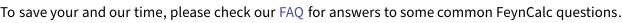


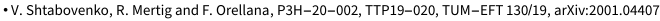


## Generate Feynman diagrams

Here we consider only the dominant contribution from the top quark mass. However, it is trivial to include also loops from other quark flavors.

```mathematica
diags = InsertFields[CreateTopologies[1, 1 -> 2, 
         ExcludeTopologies -> WFCorrections], 
       {S[1]} -> {V[5], V[5]}, InsertionLevel -> {Particles}, 
       Model -> "SMQCD", ExcludeParticles -> {F[3 | 4, {1 | 2}], 
           F[4, {3}]}]; 
Paint[diags, ColumnsXRows -> {2, 1}, Numbering -> Simple, 
     SheetHeader -> None, ImageSize -> {512, 256}]; 
```

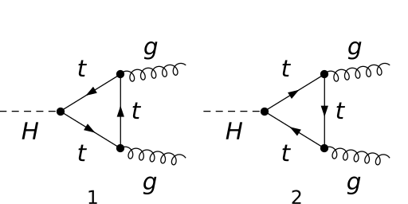

## Obtain the amplitudes

```mathematica
amp[0] = FCFAConvert[CreateFeynAmp[diags, PreFactor -> -1], 
       IncomingMomenta -> {pH}, OutgoingMomenta -> {k1, k2}, 
       LoopMomenta -> {q}, List -> False, Contract -> True, 
       TransversePolarizationVectors -> {k1, k2}, 
       ChangeDimension -> D, DropSumOver -> True, SMP -> True, 
       UndoChiralSplittings -> True]; 
```

```mathematica
amp[1] = SUNSimplify[FCTraceFactor[amp[0]]]
```

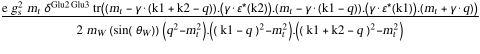

## Fix the kinematics

```mathematica
FCClearScalarProducts[]; 
ScalarProduct[k1, k1] = 0; 
ScalarProduct[k2, k2] = 0; 
ScalarProduct[pH, pH] = SMP["m_H"]^2; 
ScalarProduct[k1, k2] = SMP["m_H"]^2/2; 
```

## Evaluate the amplitudes

Dirac trace and tensor decomposition

```mathematica
amp[2] = (TID[#1, q, ToPaVe -> True] & )[DiracSimplify[amp[1]]]
```


The explicit values for the PaVe functions B0 and  C0 can be obtained e.g. from H. Patel's Package-X. Here we just insert the known results.

```mathematica
loopInts = {B0[SMP["m_H"]^2, SMP["m_t"]^2, SMP["m_t"]^2] -> 
         1/(16*Epsilon*Pi^4) - (-2*SMP["m_H"] + 
                EulerGamma*SMP["m_H"] - Log[4*Pi]*SMP["m_H"] - 
                Log[ScaleMu^2/SMP["m_t"]^2]*SMP["m_H"] - 
                Log[(-SMP["m_H"]^2 + 2*SMP["m_t"]^2 + SMP["m_H"]*
                           Sqrt[SMP["m_H"]^2 - 4*SMP["m_t"]^2])/
                      (2*SMP["m_t"]^2)]*Sqrt[SMP["m_H"]^2 - 
                      4*SMP["m_t"]^2])/(16*Pi^4*SMP["m_H"]), 
       C0[0, 0, SMP["m_H"]^2, SMP["m_t"]^2, SMP["m_t"]^2, 
           SMP["m_t"]^2] -> 
         Log[(-SMP["m_H"]^2 + 2*SMP["m_t"]^2 + SMP["m_H"]*
                      Sqrt[SMP["m_H"]^2 - 4*SMP["m_t"]^2])/
                 (2*SMP["m_t"]^2)]^2/(32*Pi^4*SMP["m_H"]^2)}; 
```

```mathematica
$Assumptions = {SMP["m_H"] > 0, SMP["m_t"] > 0}; 
amp[3] = Normal[(Series[#1, {Epsilon, 0, 0}] & )[
       (FCReplaceD[#1, D -> 4 - 2*Epsilon] & )[
         amp[2] /. loopInts]]]
```

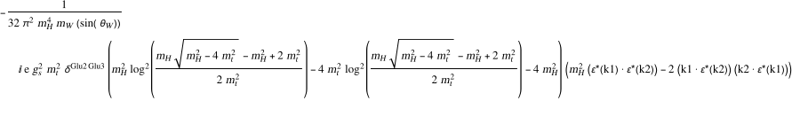

As expected, the result is finite (i.e. contains no 1/Epsilon poles), so that it is safe to switch back to 4 dimensions

```mathematica
amp[4] = (ChangeDimension[#1, 4] & )[amp[3]]
```

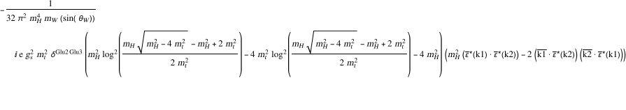

## Square the amplitudes

```mathematica
ampSquared[0] = Simplify[(DoPolarizationSums[#1, k2, k1] & )[
       (DoPolarizationSums[#1, k1, k2] & )[
         (SUNSimplify[#1, SUNNToCACF -> False] & )[
           (1/2)*(amp[4]*ComplexConjugate[amp[4]])]]]]
```


## Total decay rate

```mathematica
phaseSpacePrefactor[m_] := (1/(16*Pi*SMP["m_H"]))*
     Sqrt[1 - 4*(m^2/SMP["m_H"]^2)]
```

```mathematica
totalDecayRate = Simplify[
     (#1 /. {SMP["e"]^2 -> 4*Pi*SMP["alpha_fs"], 
              SMP["g_s"]^4 -> 16*Pi^2*SMP["alpha_s"]^2} & )[
       phaseSpacePrefactor[0]*ampSquared[0]]]
```

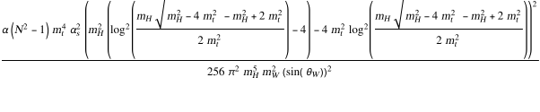

```mathematica
ISq = totalDecayRate/((SMP["alpha_s"]^2/(9*Pi^2))*
        (SMP["m_H"]^2/SMP["m_W"]^2)*SMP["alpha_fs"]*
        (SMP["m_H"]/(8*SMP["sin_W"]^2)))
```

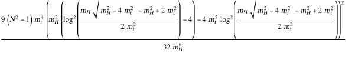

ISq corresponds to I(m_H^2/m_q^2) from Peskin and Schroeder, Final Project 3, part (c). It should go to 1 for m_q -> Infinity and to 0 for m_q -> 0

```mathematica
limit1 = Limit[ISq, SMP["m_t"] -> Infinity] /. SUNN -> 3
limit2 = Limit[ISq, SMP["m_t"] -> 0]
```

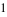

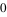

## Check the final results

```mathematica
knownResults = {1, 0}; 
FCCompareResults[{limit1, limit2}, knownResults, 
     Factoring -> Simplify, Text -> {"\tCompare to Peskin and \
     Schroeder,An Introduction to QFT, Final Project III, part (c):"\
     , "CORRECT.", "WRONG!"}, Interrupt -> {Hold[Quit[1]], 
         Automatic}]; 
Print["\tCPU Time used: ", Round[N[TimeUsed[], 3], 0.001], 
     " s."]; 
```

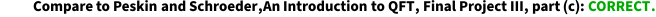

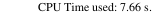