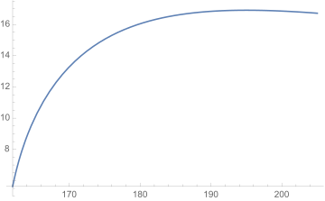

## Load FeynCalc and the necessary add-ons or other packages

```mathematica
description = "Anel El -> W W, EW, total cross section, tree"; 
If[$FrontEnd === Null, $FeynCalcStartupMessages = False; 
      Print[description]; ]; 
If[$Notebooks === False, $FeynCalcStartupMessages = False]; 
$LoadAddOns = {"FeynArts"}; 
Get["FeynCalc`"]
$FAVerbose = 0; 
FCCheckVersion[9, 3, 0]; 
```


## Generate Feynman diagrams

Nicer typesetting

```mathematica
MakeBoxes[p1, TraditionalForm] := 
     "\!\(\*SubscriptBox[\(p\), \(1\)]\)"; 
MakeBoxes[p2, TraditionalForm] := 
     "\!\(\*SubscriptBox[\(p\), \(2\)]\)"; 
MakeBoxes[k1, TraditionalForm] := 
     "\!\(\*SubscriptBox[\(k\), \(1\)]\)"; 
MakeBoxes[k2, TraditionalForm] := 
     "\!\(\*SubscriptBox[\(k\), \(2\)]\)"; 
```

```mathematica
diags = InsertFields[CreateTopologies[0, 2 -> 2], 
       {F[2, {1}], -F[2, {1}]} -> {V[3], -V[3]}, 
       InsertionLevel -> {Classes}]; 
Paint[diags, ColumnsXRows -> {2, 1}, Numbering -> Simple, 
     SheetHeader -> None, ImageSize -> {512, 256}]; 
```


## Obtain the amplitude

```mathematica
amp[0] = FCFAConvert[CreateFeynAmp[diags], 
       IncomingMomenta -> {p1, p2}, OutgoingMomenta -> {k1, k2}, 
       UndoChiralSplittings -> True, ChangeDimension -> 4, 
       List -> True, SMP -> True, Contract -> True, 
       FinalSubstitutions -> 
         {SMP["e"] -> Sqrt[4*Pi*SMP["alpha_fs"]], 
           SMP["m_Z"] -> SMP["m_W"]/SMP["cos_W"]}]; 
```

Let us separately mark the Higgs contribution separately

```mathematica
amp[1] = {markHiggs*amp[0][[1]], amp[0][[2]], amp[0][[3]], 
       amp[0][[4]]}; 
```

```mathematica
amp[2] = DiracSimplify[Total[amp[1]]]; 
```

## Fix the kinematics

```mathematica
FCClearScalarProducts[]; 
SetMandelstam[s, t, u, p1, p2, -k1, -k2, SMP["m_e"], 
     SMP["m_e"], SMP["m_W"], SMP["m_W"]]; 
```

## Square the amplitude

```mathematica
ampSquared[0] = (TrickMandelstam[#1, {s, t, u, 
              2*SMP["m_e"]^2 + 2*SMP["m_W"]^2}] & )[
       (DoPolarizationSums[#1, k2] & )[
         (DoPolarizationSums[#1, k1] & )[DiracSimplify[
             (FermionSpinSum[#1, ExtraFactor -> 1/2^2] & )[
               FeynAmpDenominatorExplicit[amp[2]*ComplexConjugate[
                     amp[2]]]]]]]]; 
```

```mathematica
ampSquaredFull[0] = Simplify[ampSquared[0] /. markHiggs -> 1 /. 
         u -> 2*SMP["m_e"]^2 + 2*SMP["m_W"]^2 - s - t]; 
```

```mathematica
ampSquaredFull[1] = Simplify[Numerator[ampSquaredFull[0]] /. 
         SMP["cos_W"] -> Sqrt[1 - SMP["sin_W"]^2]]/
     Denominator[ampSquaredFull[0]]
```


The Higgs diagram is needed to cancel the divergence that goes like m_e*Sqrt[s] in the high energy limit.
If we neglect the electron mass, then this particular diagram does not contribute.

```mathematica
ampSquaredMassless[0] = Simplify[
       ampSquared[0] /. SMP["m_e"] -> 0 /. 
         u -> 2*SMP["m_W"]^2 - s - t]; 
```

```mathematica
ampSquaredMassless[1] = 
   Simplify[Numerator[ampSquaredMassless[0]] /. 
         SMP["cos_W"] -> Sqrt[1 - SMP["sin_W"]^2]]/
     Denominator[ampSquaredMassless[0]]
```


## Total cross section

```mathematica
prefac = 1/(16*Pi*s^2); 
integral = prefac*Integrate[ampSquaredFull[1], t]; 
```

```mathematica
logFreePart = SelectFree2[integral, Log]; 
logPartRaw = Simplify[SelectNotFree2[integral, Log]]; 
```

```mathematica
tUpper = (-2^(-1))*(s - 2*SMP["m_W"]^2 - 2*SMP["m_e"]^2 - 
          Sqrt[(s - 4*SMP["m_e"]^2)*(s - 4*SMP["m_W"]^2)]); 
tLower = (-2^(-1))*(s - 2*SMP["m_W"]^2 - 2*SMP["m_e"]^2 + 
          Sqrt[(s - 4*SMP["m_e"]^2)*(s - 4*SMP["m_W"]^2)]); 
```

```mathematica
logPart = Simplify[Numerator[logPartRaw]/
       (Denominator[logPartRaw] /. 
          ((-s)*SMP["cos_W"]^2 + SMP["m_W"]^2)^2 -> 
            ((-s)*SMP["cos_W"]^2 + SMP["m_W"]^2)*
              ((-s)*(1 - SMP["sin_W"]^2) + SMP["m_W"]^2))]
```


```mathematica
xsectionPart1 = Simplify[PowerExpand[
       Simplify[(logFreePart /. {t -> tUpper}) - 
           (logFreePart /. {t -> tLower})]]]
```


```mathematica
xsectionPart2 = Simplify[logPart /. Log[t + (a_: 0)] :> 
         Log[(tUpper + a)/(tLower + a)]]
```


```mathematica
crossSectionTotal = xsectionPart1 + xsectionPart2
```


Neglecting the electron mass produces a much simpler formula for the total cross section

```mathematica
xsectionMasslessPart1 = 
   (Collect2[#1, SMP["sin_W"], Factoring -> Factor2, 
          FCFactorOut -> Pi*SMP["alpha_fs"]^2*
              (Sqrt[s - 4*SMP["m_W"]^2]/(96*s^2*Sqrt[s]*
                    ((-s)*SMP["cos_W"]^2 + SMP["m_W"]^2)^2*
                    SMP["sin_W"]^4))] & )[
  xsectionPart1 /. SMP["m_e"] -> 0]
```


```mathematica
xsectionMasslessPart2 = 
   (Collect2[#1, SMP["sin_W"], Factoring -> Factor2, 
          FCFactorOut -> Log[(s - 2*SMP["m_W"]^2 - 
                     Sqrt[s*(s - 4*SMP["m_W"]^2)])/(s - 
           2*SMP["m_W"]^2 + 
                     Sqrt[s*(s - 4*SMP["m_W"]^2)])]*
       Pi*(SMP["alpha_fs"]^2/
                 (96*s^3*((-s)*SMP["cos_W"]^2 + SMP["m_W"]^2)*
                    SMP["sin_W"]^4))] & )[
  xsectionPart2 /. SMP["m_e"] -> 0]
```


```mathematica
crossSectionTotalMassless = xsectionMasslessPart1 + 
     xsectionMasslessPart2
```


We can also plot the full cross-section (in pb) as a function of Sqrt[s] (in GeV)

```mathematica
crossSectionTotalPlot = Simplify[3.89*10^8*crossSectionTotal /. 
       {SMP["m_e"] -> 0.51/10^3, SMP["m_H"] -> 125., 
         SMP["m_W"] -> 80.4, SMP["sin_W"] -> Sqrt[0.231], 
         SMP["cos_W"] -> Sqrt[1. - 0.231], SMP["alpha_fs"] -> 
           1/137, s -> sqrtS^2}]
```


The plot can be compared to the one in Physics at LEP2: Vol. 1 (Altarelli:1996gh), page 93, Fig. 2

```mathematica
If[$FrontEnd =!= Null, Plot[crossSectionTotalPlot, 
     {sqrtS, 162, 205}]]
```



## Check the final results

```mathematica
knownResults = 
     {(Pi*Log[(-2 + s - Sqrt[(-4 + s)*s])/(-2 + s + 
                     Sqrt[(-4 + s)*s])]*SMP["alpha_fs"]^2*
              (24*s*(4 + s + s^2) - 24*(4 + 10*s + 2*s^2 + s^3)*
                   SMP["sin_W"]^2))/(96*s^3*(1 - s*SMP["cos_W"]^2)*
              SMP["sin_W"]^4) + (Pi*Sqrt[-4 + s]*SMP["alpha_fs"]^2*
              (-3*s*(32 - 20*s + 21*s^2) + 16*(3 + 8*s)*(2 + s^2)*
                   SMP["sin_W"]^2 - 4*(96 + 160*s + 8*s^2 + 15*s^3)*
                   SMP["sin_W"]^4))/(96*
       s^(5/2)*(1 - s*SMP["cos_W"]^2)^2*
              SMP["sin_W"]^4)}; 
FCCompareResults[{crossSectionTotalMassless /. 
         SMP["m_W"] -> 1}, knownResults, 
     Text -> {"\tCompare to Grozin, Using REDUCE in High Energy \
    Physics, Chapter 5.4:", "CORRECT.", "WRONG!"}, 
     Interrupt -> {Hold[Quit[1]], Automatic}]; 
Print["\tCPU Time used: ", Round[N[TimeUsed[], 3], 0.001], 
     " s."]; 
```


