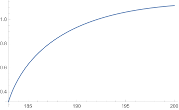

## Load FeynCalc and the necessary add-ons or other packages

```mathematica
description = "Anel El -> Z Z, EW, total cross section, tree"; 
If[$FrontEnd === Null, $FeynCalcStartupMessages = False; 
      Print[description]; ]; 
If[$Notebooks === False, $FeynCalcStartupMessages = False]; 
$LoadAddOns = {"FeynArts"}; 
Get["FeynCalc`"]
$FAVerbose = 0; 
FCCheckVersion[9, 3, 0]; 
```


## Generate Feynman diagrams

Nicer typesetting

```mathematica
MakeBoxes[p1, TraditionalForm] := 
     "\!\(\*SubscriptBox[\(p\), \(1\)]\)"; 
MakeBoxes[p2, TraditionalForm] := 
     "\!\(\*SubscriptBox[\(p\), \(2\)]\)"; 
MakeBoxes[k1, TraditionalForm] := 
     "\!\(\*SubscriptBox[\(k\), \(1\)]\)"; 
MakeBoxes[k2, TraditionalForm] := 
     "\!\(\*SubscriptBox[\(k\), \(2\)]\)"; 
```

```mathematica
diags = InsertFields[CreateTopologies[0, 2 -> 2], 
       {F[2, {1}], -F[2, {1}]} -> {V[2], V[2]}, 
       InsertionLevel -> {Classes}]; 
Paint[diags, ColumnsXRows -> {3, 1}, Numbering -> Simple, 
     SheetHeader -> None, ImageSize -> {512, 256}]; 
```


## Obtain the amplitude

```mathematica
amp[0] = FCFAConvert[CreateFeynAmp[diags], 
       IncomingMomenta -> {p1, p2}, OutgoingMomenta -> {k1, k2}, 
       UndoChiralSplittings -> True, ChangeDimension -> 4, 
       TransversePolarizationVectors -> {k1, k2}, List -> True, 
       SMP -> True, Contract -> True, FinalSubstitutions -> 
         {SMP["e"] -> Sqrt[4*Pi*SMP["alpha_fs"]], 
           SMP["m_W"] -> SMP["m_Z"]*SMP["cos_W"]}]; 
```

Let us separately mark the Higgs contribution separately

```mathematica
amp[1] = {markHiggs*amp[0][[1]], amp[0][[2]], amp[0][[3]]}; 
```

```mathematica
amp[2] = DiracSimplify[Total[amp[1]]]; 
```

## Fix the kinematics

```mathematica
FCClearScalarProducts[]; 
SetMandelstam[s, t, u, p1, p2, -k1, -k2, SMP["m_e"], 
     SMP["m_e"], SMP["m_Z"], SMP["m_Z"]]; 
```

## Square the amplitude

We need to multiply by 1/2 to account for two identical particles in the final state

```mathematica
ampSquared[0] = (TrickMandelstam[#1, {s, t, u, 
              2*SMP["m_e"]^2 + 2*SMP["m_Z"]^2}] & )[
       (DoPolarizationSums[#1, k2] & )[
         (DoPolarizationSums[#1, k1] & )[DiracSimplify[
             (FermionSpinSum[#1, ExtraFactor -> 1/2^2] & )[
               FeynAmpDenominatorExplicit[(1/2)*(amp[2]*
                      ComplexConjugate[amp[2]])]]]]]]; 
```

```mathematica
ampSquaredFull[0] = Simplify[ampSquared[0] /. markHiggs -> 1 /. 
         u -> 2*SMP["m_e"]^2 + 2*SMP["m_Z"]^2 - s - t]; 
```

```mathematica
ampSquaredFull[1] = Simplify[Numerator[ampSquaredFull[0]] /. 
         SMP["cos_W"] -> Sqrt[1 - SMP["sin_W"]^2]]/
     Denominator[ampSquaredFull[0]]
```


If we neglect the electron mass, then the Higgs  diagram does not contribute.

```mathematica
ampSquaredMassless[0] = Simplify[
     ampSquared[0] /. SMP["m_e"] -> 0 /. 
       u -> 2*SMP["m_Z"]^2 - s - t]
```


```mathematica
ampSquaredMassless[1] = 
   Simplify[Numerator[ampSquaredMassless[0]] /. 
         SMP["cos_W"] -> Sqrt[1 - SMP["sin_W"]^2]]/
     Denominator[ampSquaredMassless[0]]
```


## Total cross section

```mathematica
prefac = 1/(16*Pi*s^2); 
integral = prefac*Integrate[ampSquaredFull[1], t]; 
```

```mathematica
logFreePart = SelectFree2[integral, Log]; 
logPart = Simplify[SelectNotFree2[integral, Log]]; 
```

```mathematica
tUpper = (-2^(-1))*(s - 2*SMP["m_Z"]^2 - 2*SMP["m_e"]^2 - 
          Sqrt[(s - 4*SMP["m_e"]^2)*(s - 4*SMP["m_Z"]^2)]); 
tLower = (-2^(-1))*(s - 2*SMP["m_Z"]^2 - 2*SMP["m_e"]^2 + 
          Sqrt[(s - 4*SMP["m_e"]^2)*(s - 4*SMP["m_Z"]^2)]); 
```

```mathematica
xsectionPart1 = Simplify[(logFreePart /. {t -> tUpper}) - 
       (logFreePart /. {t -> tLower})]
```


```mathematica
xsectionPart2 = Simplify[logPart /. Log[t + (a_: 0)] :> 
         Log[(tUpper + a)/(tLower + a)]]
```


```mathematica
crossSectionTotal = xsectionPart1 + xsectionPart2
```


Neglecting the electron mass produces a much simpler formula for the total cross section

```mathematica
xsectionMasslessPart1 = Simplify[xsectionPart1 /. 
       SMP["m_e"] -> 0]
```


```mathematica
xsectionMasslessPart2 = Simplify[xsectionPart2 /. 
       SMP["m_e"] -> 0]
```


```mathematica
crossSectionTotalMassless = xsectionMasslessPart1 + 
     xsectionMasslessPart2
```


We can also plot the full cross-section (in pb) as a function of Sqrt[s] (in GeV)

```mathematica
crossSectionTotalPlot = Simplify[3.89*10^8*crossSectionTotal /. 
       {SMP["m_e"] -> 0.51/10^3, SMP["m_H"] -> 125., 
         SMP["m_Z"] -> 91.2, SMP["sin_W"] -> Sqrt[0.231], 
         SMP["cos_W"] -> Sqrt[1. - 0.231], SMP["alpha_fs"] -> 
           1/137, s -> sqrtS^2}]
```


The plot can be compared to the one in  arXiv:hep-ex/9911003, Fig. 8

```mathematica
If[$FrontEnd =!= Null, Plot[crossSectionTotalPlot, 
     {sqrtS, 183, 200}]]
```



## Check the final results

```mathematica
knownResults = 
     {-(Pi*(4*(-2 + s)*Sqrt[(-4 + s)*s] + (4 + s^2)*
                   Log[(-2 + s - Sqrt[(-4 + s)*s])/(-2 + s + 
                          Sqrt[(-4 + s)*s])] - (4 + s^2)*
                   Log[(-2 + s + Sqrt[(-4 + s)*s])/(-2 + s - 
                          Sqrt[(-4 + s)*s])])*SMP["alpha_fs"]^2*
              (1 - 8*SMP["sin_W"]^2 + 24*SMP["sin_W"]^4 - 
                 32*SMP["sin_W"]^6 + 32*SMP["sin_W"]^8))/
         (32*(-2 + s)*s^2*SMP["cos_W"]^4*SMP["sin_W"]^4)}; 
FCCompareResults[{crossSectionTotalMassless /. 
         SMP["m_Z"] -> 1}, knownResults, 
     Text -> {"\tCompare to the known result: ", "CORRECT.", 
         "WRONG!"}, Interrupt -> {Hold[Quit[1]], Automatic}]; 
Print["\tCPU Time used: ", Round[N[TimeUsed[], 3], 0.001], 
     " s."]; 
```


