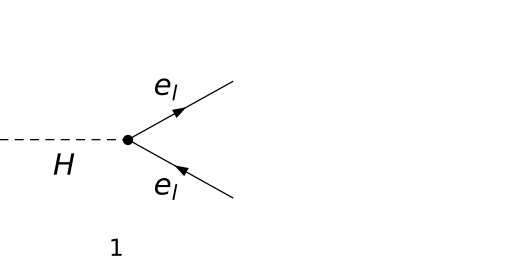
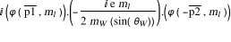
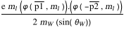
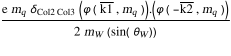
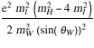
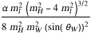
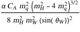
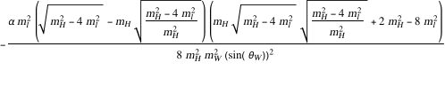
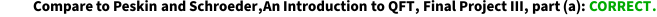
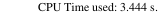

## Load FeynCalc and the necessary add-ons or other packages

```mathematica
description = "H -> F Fbar, EW, total decay rate, tree"; 
If[$FrontEnd === Null, $FeynCalcStartupMessages = False; 
      Print[description]; ]; 
If[$Notebooks === False, $FeynCalcStartupMessages = False]; 
$LoadAddOns = {"FeynArts"}; 
Get["FeynCalc`"]
$FAVerbose = 0; 
FCCheckVersion[9, 3, 0]; 
```


## Generate Feynman diagrams

```mathematica
diagsLeptons = InsertFields[CreateTopologies[0, 1 -> 2], 
       {S[1]} -> {F[2, {l}], -F[2, {l}]}, InsertionLevel -> 
         {Classes}]; 
Paint[diagsLeptons, ColumnsXRows -> {2, 1}, 
     Numbering -> Simple, SheetHeader -> None, 
     ImageSize -> {512, 256}]; 
```



```mathematica
diagsQuarks = InsertFields[CreateTopologies[0, 1 -> 2], 
       {S[1]} -> {F[3, {l}], -F[3, {l}]}, InsertionLevel -> 
         {Classes}]; 
Paint[diagsQuarks, ColumnsXRows -> {2, 1}, Numbering -> Simple, 
     SheetHeader -> None, ImageSize -> {512, 256}]; 
```


## Obtain the amplitudes

```mathematica
ampLeptons[0] = FCFAConvert[CreateFeynAmp[diagsLeptons], 
     IncomingMomenta -> {pH}, OutgoingMomenta -> {p1, p2}, 
     List -> False, ChangeDimension -> 4, DropSumOver -> True, 
     SMP -> True, Contract -> True, UndoChiralSplittings -> True, 
     FinalSubstitutions -> {MLE[l] -> SMP["m_l"]}]
```



```mathematica
ampQuarks[0] = FCFAConvert[CreateFeynAmp[diagsQuarks], 
     IncomingMomenta -> {pH}, OutgoingMomenta -> {k1, k2}, 
     List -> False, ChangeDimension -> 4, DropSumOver -> True, 
     SMP -> True, Contract -> True, UndoChiralSplittings -> True, 
     FinalSubstitutions -> {MQU[l] -> SMP["m_q"]}]
```


```mathematica
ampLeptons[1] = DiracSimplify[ampLeptons[0]]
```



```mathematica
ampQuarks[1] = DiracSimplify[ampQuarks[0]]
```



## Fix the kinematics

```mathematica
FCClearScalarProducts[]; 
SP[p1, p1] = SMP["m_l"]^2; 
SP[k1, k1] = SMP["m_q"]^2; 
SP[p2, p2] = SMP["m_l"]^2; 
SP[k2, k2] = SMP["m_q"]^2; 
SP[pH, pH] = SMP["m_H"]^2; 
SP[p1, p2] = (SMP["m_H"]^2 - 2*SMP["m_l"]^2)/2; 
SP[k1, k2] = (SMP["m_H"]^2 - 2*SMP["m_q"]^2)/2; 
```

## Square the amplitudes

```mathematica
ampLeptonsSquared[0] = Simplify[DiracSimplify[
       FermionSpinSum[ampLeptons[1]*ComplexConjugate[
             ampLeptons[1]]]]]
```



```mathematica
ampQuarksSquared[0] = SUNSimplify[DiracSimplify[
       FermionSpinSum[ampQuarks[1]*ComplexConjugate[
             ampQuarks[1]]]]]
```


## Total decay rates

```mathematica
$Assumptions = {SMP["m_H"] > 0, SMP["m_l"] > 0}; 
phaseSpacePrefactor[m_] := (1/(16*Pi*SMP["m_H"]))*
       Sqrt[1 - 4*(m^2/SMP["m_H"]^2)]; 
```

```mathematica
totalDecayRateLeptons = Simplify[
     (#1 /. SMP["e"]^2 -> 4*Pi*SMP["alpha_fs"] & )[
       phaseSpacePrefactor[SMP["m_l"]]*ampLeptonsSquared[0]]]
```



```mathematica
totalDecayRateQuarks = Simplify[
     (#1 /. SMP["e"]^2 -> 4*Pi*SMP["alpha_fs"] & )[
       phaseSpacePrefactor[SMP["m_q"]]*ampQuarksSquared[0]]]
```



```mathematica
Factor[((AlphaFS*SMP["m_H"])/(8*SMP["sin_W"]^2))*
       ((SMP["m_l"]^2/SMP["m_W"]^2)*
          (1 - 4*(SMP["m_l"]^2/SMP["m_H"]^2))^(3/2)) - 
     totalDecayRateLeptons]
```



## Check the final results

```mathematica
knownResults = {((AlphaFS*SMP["m_H"])/(8*SMP["sin_W"]^2))*
         ((SMP["m_l"]^2/SMP["m_W"]^2)*
            (1 - 4*(SMP["m_l"]^2/SMP["m_H"]^2))^(3/2)), 
       (CA*SMP["alpha_fs"]*SMP["m_H"]*SMP["m_q"]^2*
            (1 - (4*SMP["m_q"]^2)/SMP["m_H"]^2)^(3/2))/
         (8*SMP["m_W"]^2*SMP["sin_W"]^2)}; 
FCCompareResults[{totalDecayRateLeptons, totalDecayRateQuarks}, 
     knownResults, Factoring -> Simplify, 
     Text -> {"\tCompare to Peskin and Schroeder,An Introduction \
    to QFT, Final Project III, part (a):", "CORRECT.", "WRONG!"}, 
     Interrupt -> {Hold[Quit[1]], Automatic}]; 
Print["\tCPU Time used: ", Round[N[TimeUsed[], 3], 0.001], 
     " s."]; 
```



