## Load FeynCalc and the necessary add-ons or other packages

```mathematica
description = "Mu -> El Anel Nmu, EW, total decay rate, tree"; 
If[$FrontEnd === Null, $FeynCalcStartupMessages = False; 
      Print[description]; ]; 
If[$Notebooks === False, $FeynCalcStartupMessages = False]; 
$LoadAddOns = {"FeynArts"}; 
Get["FeynCalc`"]
$FAVerbose = 0; 
FCCheckVersion[9, 3, 0]; 
```


## Generate Feynman diagrams

Nicer typesetting

```mathematica
MakeBoxes[q1, TraditionalForm] := 
     "\!\(\*SubscriptBox[\(q\), \(1\)]\)"; 
MakeBoxes[q2, TraditionalForm] := 
     "\!\(\*SubscriptBox[\(q\), \(2\)]\)"; 
```

To avoid dealing with Goldstone bosons we do  the computation in the unitary gauge

```mathematica
InitializeModel[{SM, UnitarySM}, GenericModel -> 
       {Lorentz, UnitaryLorentz}]; 
```

```mathematica
diags = InsertFields[CreateTopologies[0, 1 -> 3], 
       {F[2, {2}]} -> {F[2, {1}], -F[1, {1}], F[1, {2}]}, 
       InsertionLevel -> {Classes}, Model -> {SM, UnitarySM}, 
       GenericModel -> {Lorentz, UnitaryLorentz}]; 
Paint[diags, ColumnsXRows -> {2, 1}, Numbering -> Simple, 
     SheetHeader -> None, ImageSize -> {512, 256}]; 
```

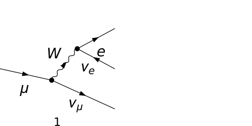

## Obtain the amplitude

```mathematica
amp[0] = FCFAConvert[CreateFeynAmp[diags, 
       GaugeRules -> {FAGaugeXi[W | Z] -> Infinity}], 
     IncomingMomenta -> {p}, OutgoingMomenta -> {k, q1, q2}, 
     ChangeDimension -> 4, List -> False, SMP -> True, 
     Contract -> True, DropSumOver -> True, 
     FinalSubstitutions -> 
       {SMP["e"] -> Sqrt[(8/Sqrt[2])*SMP["G_F"]*SMP["m_W"]^2*
               SMP["sin_W"]^2]}]
```

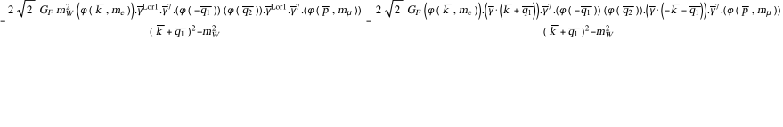

## Fix the kinematics

```mathematica
FCClearScalarProducts[]
SP[k, k] = SMP["m_e"]^2; 
SP[q1, q1] = 0; 
SP[q2, q2] = 0; 
```

## Square the amplitude

We average over the polarizations of the muon, hence the additional factor 1/2

```mathematica
ampSquared[0] = Factor[DiracSimplify[
       (FermionSpinSum[#1, ExtraFactor -> 1/2] & )[
         amp[0]*ComplexConjugate[amp[0]]]]]
```

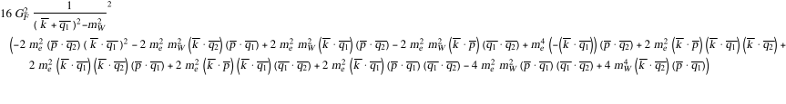

In the following we neglect the momentum in the W-propagator as compared to the W-mass. This is a very good approximation at low energies, as then (k+q1)^2  <= m_mu^2 << m_W^2.

```mathematica
ampSquared[1] = Normal[
     (Series[#1, {SMP["m_W"], Infinity, 0}] & )[
       FeynAmpDenominatorExplicit[(#1 /. {k + q1 -> 0} & )[
           FCE[ampSquared[0]]]]]]
```

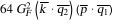

## Total decay rate

To compute the total decay rate, we follow the calculation done in Okun, Leptons and Quarks, Chapter 3. The differential decay rate is given by

d Γ = 1/(2M) d^3 k / ((2π)^3 2 k^0) d^3 q1 / ((2π)^3 2 q1^0) d^3 q2 / ((2π)^3 2 q2^0) (2π)^4 δ^4 (q-q1-q2) sqAmpMuonDecayTree2 with q = p-k

```mathematica
prefac = (2*SMP["m_mu"]*(2*Pi)^5*8)^(-1); 
diffDecayRate = prefac*(d3q1/En[q1])*(d3q2/En[q2])*(d3k/En[k])*
     delta4[q - q1 - q2]*ampSquared[1]
```


First we reduce the tensor integrals in q1 to q2 to scalar ones by using tensor decomposition

```mathematica
q1q2[mu_, nu_] := Tdec[{ {q1x, mu}, {q2x, nu} }, {q}, 
         List -> False, Dimension -> 4] /. 
       {SP[q1x, q2x] -> SP[q, q]/2, SP[q, q1x | q2x] -> 
           SP[q, q]/2}; 
```

```mathematica
Factor2[q1q2[mu, nu]]
```

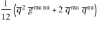

```mathematica
diffDecayRate1 = Uncontract[diffDecayRate, q1, q2, Pair -> All]
```

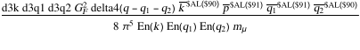

```mathematica
diffDecayRate2 = FCE[Contract[FCE[diffDecayRate1] /. 
         FV[q1, mu_]*FV[q2, nu_] :> q1q2[mu, nu]]]
```

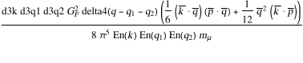

Integrating over q1 and q2 (in the rest frame of the decaying muon) we get rid of the Dirac delta and simplify the integral

```mathematica
diffDecayRate3 = 
   diffDecayRate2 /. {d3q2*delta4[q - q1 - q2] -> 
               delta[En[q] - 2*En[q1]]} /. {En[q2] -> En[q1]} /. 
       {d3q1 -> 4*Pi*dq10*En[q1]^2} /. 
     {dq10*delta[En[q] - 2*En[q1]] -> 1/2}
```

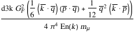

Then we use the kinematics of the process, to simplify things even further. Here we also use the fact that the mass of the electron is very small as compared to its energy

```mathematica
diffDecayRate4 = Simplify[diffDecayRate3 //. 
       {SP[q, p] -> SMP["m_mu"]^2 - SMP["m_mu"]*En[k], 
         SP[k, q] | SP[p, k] -> SMP["m_mu"]*En[k], 
         SP[q, q] -> SMP["m_mu"]^2 - 2*SMP["m_mu"]*En[k]}]
```

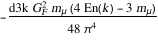

Next we trade d3k for dOmega d k^0  (k^0)^2  and introduce Eps  that is defined as 2 k^0/ m_mu

```mathematica
diffDecayRate5 = Factor2[
     diffDecayRate4 /. d3k -> dk0*En[k]^2*4*Pi /. 
         En[k] -> Eps*(SMP["m_mu"]/2) /. 
       dk0 -> dEps*(SMP["m_mu"]/2)]
```

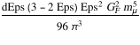

Integrating over Eps we arrive to the final result

```mathematica
decayRateTotal = Integrate[diffDecayRate5 /. dEps -> 1, 
     {Eps, 0, 1}]
```

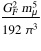

## Check the final results

```mathematica
knownResults = {(SMP["G_F"]^2*SMP["m_mu"]^5)/(192*Pi^3)}; 
FCCompareResults[{decayRateTotal}, knownResults, 
     Text -> 
       {"\tCompare to Okun, Leptons and Quarks, Chapter 3.2:", 
         "CORRECT.", "WRONG!"}, Interrupt -> 
       {Hold[Quit[1]], Automatic}]; 
Print["\tCPU Time used: ", Round[N[TimeUsed[], 3], 0.001], 
     " s."]; 
```


