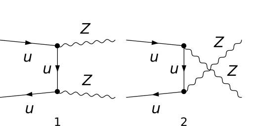
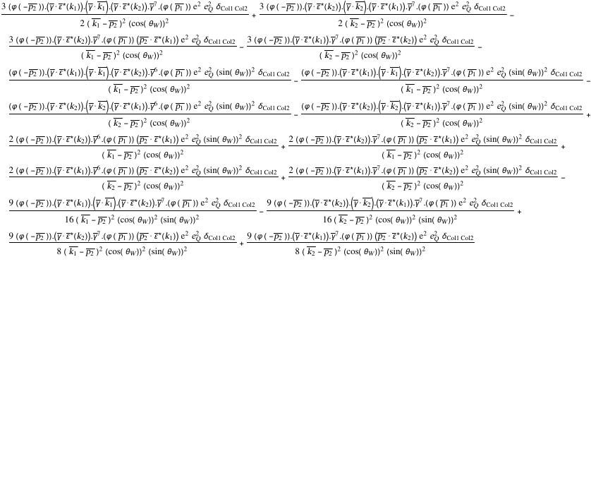
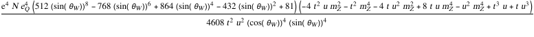
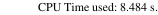

## Load FeynCalc and the necessary add-ons or other packages

```mathematica
description = 
     "Q Qbar -> Z Z, EW, matrix element squared, tree"; 
If[$FrontEnd === Null, $FeynCalcStartupMessages = False; 
      Print[description]; ]; 
If[$Notebooks === False, $FeynCalcStartupMessages = False]; 
$LoadAddOns = {"FeynArts"}; 
Get["FeynCalc`"]
$FAVerbose = 0; 
FCCheckVersion[9, 3, 0]; 
```


## Generate Feynman diagrams

Nicer typesetting

```mathematica
MakeBoxes[p1, TraditionalForm] := 
     "\!\(\*SubscriptBox[\(p\), \(1\)]\)"; 
MakeBoxes[p2, TraditionalForm] := 
     "\!\(\*SubscriptBox[\(p\), \(2\)]\)"; 
MakeBoxes[k1, TraditionalForm] := 
     "\!\(\*SubscriptBox[\(k\), \(1\)]\)"; 
MakeBoxes[k2, TraditionalForm] := 
     "\!\(\*SubscriptBox[\(k\), \(2\)]\)"; 
```

```mathematica
diags = InsertFields[CreateTopologies[0, 2 -> 2], 
       {F[3, {1}], -F[3, {1}]} -> {V[2], V[2]}, 
       InsertionLevel -> {Particles}, ExcludeParticles -> {S[_]}]; 
Paint[diags, ColumnsXRows -> {2, 1}, Numbering -> Simple, 
     SheetHeader -> None, ImageSize -> {512, 256}]; 
```



## Obtain the amplitude

For simplicity let us neglect the masses of the quarks

```mathematica
amp[0] = (9/4)*SMP["e_Q"]^2*FCFAConvert[CreateFeynAmp[diags], 
         IncomingMomenta -> {p1, p2}, OutgoingMomenta -> {k1, k2}, 
         ChangeDimension -> 4, List -> False, SMP -> True, 
         Contract -> True, DropSumOver -> True, 
         TransversePolarizationVectors -> {k1, k2}, 
         FinalSubstitutions -> {SMP["m_u"] -> 0}]; 
```

```mathematica
amp[1] = DiracSimplify[amp[0]]
```



## Fix the kinematics

```mathematica
FCClearScalarProducts[]; 
SetMandelstam[s, t, u, p1, p2, -k1, -k2, 0, 0, SMP["m_Z"], 
     SMP["m_Z"]]; 
```

## Square the amplitude

We average over the spins and the colors of the quarks, hence the additional factor 1/3^2 1/2^2. Since the final state particles are indistinguishable, we add an extra 1/2.

```mathematica
ampSquared[0] = 
   (TrickMandelstam[#1, {s, t, u, 2*SMP["m_Z"]^2}] & )[
     (SUNSimplify[#1, SUNNToCACF -> False] & )[
       (DoPolarizationSums[#1, k2] & )[
         (DoPolarizationSums[#1, k1] & )[DiracSimplify[
             (FermionSpinSum[#1, ExtraFactor -> 1/2^2] & )[
               FeynAmpDenominatorExplicit[(1/3^2)*(1/2)*
                   (amp[1]*ComplexConjugate[amp[1]])]]]]]]]
```



## Check the final results

```mathematica
knownResults = {2*SMP["e"]^4*(SUNN/72)*
         (((-SMP["e_Q"])*(SMP["sin_W"]/SMP["cos_W"]))^4 + 
            ((3/2)*SMP["e_Q"]*(1/(2*SMP["sin_W"]*SMP["cos_W"])) - 
                 SMP["e_Q"]*(SMP["sin_W"]/SMP["cos_W"]))^4)*
         (2*(t/u + u/t - SMP["m_Z"]^4*(1/t^2 + 1/u^2)) + 
            8*SMP["m_Z"]^2*(s/(t*u)))}; 
FCCompareResults[{ampSquared[0]}, knownResults, 
     Factoring -> Function[x, TrickMandelstam[x, 
           {s, t, u, 2*SMP["m_Z"]^2}]], 
     Text -> {"\tCompare to J. Ohnemus and J. Owens, Phys. Rev. \
    D43, 3626-3639, 1991, Eq. 4:", "CORRECT.", "WRONG!"}, 
     Interrupt -> {Hold[Quit[1]], Automatic}]; 
Print["\tCPU Time used: ", Round[N[TimeUsed[], 3], 0.001], 
     " s."]; 
```


