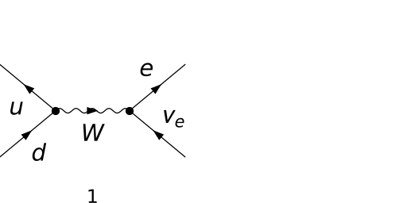
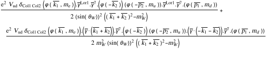
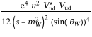
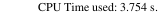

## Load FeynCalc and the necessary add-ons or other packages

```mathematica
description = 
     "Qutbar Qdt -> Nel Anel, EW, matrix element squared, tree"; 
If[$FrontEnd === Null, $FeynCalcStartupMessages = False; 
      Print[description]; ]; 
If[$Notebooks === False, $FeynCalcStartupMessages = False]; 
$LoadAddOns = {"FeynArts"}; 
Get["FeynCalc`"]
$FAVerbose = 0; 
FCCheckVersion[9, 3, 0]; 
```


## Generate Feynman diagrams

Nicer typesetting

```mathematica
MakeBoxes[p1, TraditionalForm] := 
     "\!\(\*SubscriptBox[\(p\), \(1\)]\)"; 
MakeBoxes[p2, TraditionalForm] := 
     "\!\(\*SubscriptBox[\(p\), \(2\)]\)"; 
MakeBoxes[k1, TraditionalForm] := 
     "\!\(\*SubscriptBox[\(k\), \(1\)]\)"; 
MakeBoxes[k2, TraditionalForm] := 
     "\!\(\*SubscriptBox[\(k\), \(2\)]\)"; 
```

Enable CKM mixing

```mathematica
$CKM = True; 
```

To avoid dealing with Goldstone bosons we do  the computation in the unitary gauge

```mathematica
InitializeModel[{SM, UnitarySM}, GenericModel -> 
       {Lorentz, UnitaryLorentz}]; 
```

```mathematica
diags = InsertFields[CreateTopologies[0, 2 -> 2], 
       {-F[3, {1}], F[4, {1}]} -> {F[2, {1}], -F[1, {1}]}, 
       InsertionLevel -> {Particles}, Model -> {SM, UnitarySM}, 
       GenericModel -> {Lorentz, UnitaryLorentz}]; 
Paint[diags, ColumnsXRows -> {2, 1}, Numbering -> Simple, 
     SheetHeader -> None, ImageSize -> {512, 256}]; 
```



## Obtain the amplitude

```mathematica
amp[0] = FCFAConvert[CreateFeynAmp[diags, 
       GaugeRules -> {FAGaugeXi[W | Z] -> Infinity}], 
     IncomingMomenta -> {p2, p1}, OutgoingMomenta -> {k1, k2}, 
     ChangeDimension -> 4, List -> False, SMP -> True, 
     Contract -> True, DropSumOver -> True]
```



## Fix the kinematics

```mathematica
FCClearScalarProducts[]
SetMandelstam[s, t, u, p1, p2, -k1, -k2, 0, 0, 0, 0]; 
```

## Square the amplitude

We average over the spins and the colors of the quarks, hence the additional factor 1/3^2 1/2^2.

```mathematica
ampSquared[0] = (#1 /. SUNN -> 3 & )[
     (SUNSimplify[#1, SUNNToCACF -> False] & )[
       FeynAmpDenominatorExplicit[DiracSimplify[
           (FermionSpinSum[#1, ExtraFactor -> 1/2^2] & )[
             (1/3^2)*(amp[0]*ComplexConjugate[amp[0]])]]]]]
```



## Check the final results

```mathematica
knownResults = {(u^2*SMP["e"]^4*SMP["V_ud", -I]*SMP["V_ud", I])/
         (12*(s - SMP["m_W"]^2)^2*SMP["sin_W"]^4)}; 
FCCompareResults[{ampSquared[0]}, knownResults, 
     Text -> {"\tCompare to CompHEP:", "CORRECT.", "WRONG!"}, 
     Interrupt -> {Hold[Quit[1]], Automatic}]; 
Print["\tCPU Time used: ", Round[N[TimeUsed[], 3], 0.001], 
     " s."]; 
```


