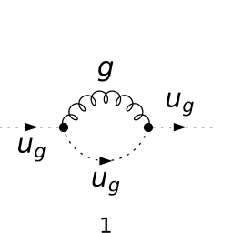
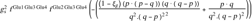
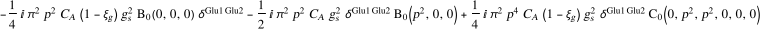
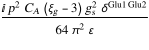
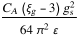
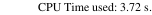

## Load FeynCalc and the necessary add-ons or other packages

```mathematica
description = "Gh -> Gh, QCD, only UV divergences, 1-loop"; 
If[$FrontEnd === Null, $FeynCalcStartupMessages = False; 
      Print[description]; ]; 
If[$Notebooks === False, $FeynCalcStartupMessages = False]; 
$LoadAddOns = {"FeynArts"}; 
Get["FeynCalc`"]
$FAVerbose = 0; 
FCCheckVersion[9, 3, 0]; 
```


## Configure some options

We keep scaleless B0 functions, since otherwise the UV part would not come out right.

```mathematica
$KeepLogDivergentScalelessIntegrals = True; 
```

## Generate Feynman diagrams

```mathematica
diags = InsertFields[CreateTopologies[1, 1 -> 1, 
         ExcludeTopologies -> {Tadpoles}], {U[5]} -> {U[5]}, 
       InsertionLevel -> {Particles}, Model -> "SMQCD"]; 
Paint[diags, ColumnsXRows -> {1, 1}, Numbering -> Simple, 
     SheetHeader -> None, ImageSize -> {256, 256}]; 
```



## Obtain the amplitude

The 1/(2Pi)^D prefactor is implicit.

```mathematica
amp[0] = FCFAConvert[CreateFeynAmp[diags, Truncated -> True, 
       GaugeRules -> {}, PreFactor -> 1], IncomingMomenta -> {p}, 
     OutgoingMomenta -> {p}, LoopMomenta -> {q}, 
     UndoChiralSplittings -> True, ChangeDimension -> D, 
     List -> False, SMP -> True, DropSumOver -> True, 
     Contract -> True]
```



## Calculate the amplitude

```mathematica
amp[1] = (TID[#1, q, ToPaVe -> True] & )[SUNSimplify[amp[0]]]
```



The UV divergence of the amplitude can be obtained via PaVeUVPart.
Here we also need to reintroduce the implicit 1/(2Pi)^D prefactor.
Hint: If you need the full result for the amplitude, use PaXEvaluate from FeynHelpers.

```mathematica
ampDiv[0] = Simplify[(SelectNotFree2[#1, Epsilon] & )[
       Normal[(Series[#1, {Epsilon, 0, 0}] & )[
           (FCReplaceD[#1, D -> 4 - 2*Epsilon] & )[
             PaVeUVPart[amp[1], Prefactor -> 1/(2*Pi)^D]]]]]]
```



The self-energy amplitude is usually defined as  (p^2 delta^ab  Pi(p^2)

```mathematica
pi[0] = Cancel[FCI[ampDiv[0]/(I*SUNDelta[SUNIndex[Glu1], 
              SUNIndex[Glu2]]*SPD[p, p])]]
```



## Check the final results

```mathematica
knownResult = (-SMP["g_s"]^2/(4*Pi)^2)*CA*((3 - GaugeXi[g])/4)*
       (1/Epsilon); 
FCCompareResults[pi[0], knownResult, 
     Text -> 
       {"\tCompare to Muta, Foundations of QCD, Eq. 2.5.136:", 
         "CORRECT.", "WRONG!"}, Interrupt -> 
       {Hold[Quit[1]], Automatic}]; 
Print["\tCPU Time used: ", Round[N[TimeUsed[], 4], 0.001], 
     " s."]; 
```


