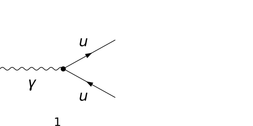
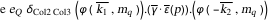
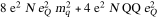
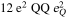
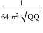
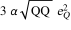
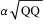
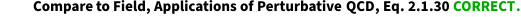
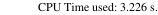

## Load FeynCalc and the necessary add-ons or other packages

```mathematica
description = "Ga^* -> Q Qbar, QCD, total decay rate, tree"; 
If[$FrontEnd === Null, $FeynCalcStartupMessages = False; 
      Print[description]; ]; 
If[$Notebooks === False, $FeynCalcStartupMessages = False]; 
$LoadAddOns = {"FeynArts"}; 
Get["FeynCalc`"]
$FAVerbose = 0; 
FCCheckVersion[9, 3, 0]; 
```


## Generate Feynman diagrams

Nicer typesetting

```mathematica
MakeBoxes[k1, TraditionalForm] := 
     "\!\(\*SubscriptBox[\(k\), \(1\)]\)"; 
MakeBoxes[k2, TraditionalForm] := 
     "\!\(\*SubscriptBox[\(k\), \(2\)]\)"; 
```

```mathematica
diags = InsertFields[CreateTopologies[0, 1 -> 2], 
       {V[1]} -> {F[3, {1}], -F[3, {1}]}, InsertionLevel -> 
         {Classes}, Model -> "SMQCD"]; 
Paint[diags, ColumnsXRows -> {2, 1}, Numbering -> Simple, 
     SheetHeader -> None, ImageSize -> {512, 256}]; 
```



## Obtain the amplitude

```mathematica
amp[0] = FCFAConvert[CreateFeynAmp[diags], 
     IncomingMomenta -> {p}, OutgoingMomenta -> {k1, k2}, 
     UndoChiralSplittings -> True, ChangeDimension -> 4, 
     List -> False, SMP -> True, Contract -> True, 
     DropSumOver -> True, Prefactor -> (3/2)*SMP["e_Q"], 
     FinalSubstitutions -> {SMP["m_u"] -> SMP["m_q"]}]
```



## Fix the kinematics

```mathematica
FCClearScalarProducts[]; 
SP[k1] = SMP["m_q"]^2; 
SP[k2] = SMP["m_q"]^2; 
SP[k1, k2] = (QQ - SP[k1] - SP[k2])/2; 
```

## Square the amplitude

```mathematica
ampSquared[0] = DiracSimplify[
     (DoPolarizationSums[#1, p, 0, VirtualBoson -> True] & )[
       FermionSpinSum[(SUNSimplify[#1, Explicit -> True, 
                SUNNToCACF -> False] & )[FeynAmpDenominatorExplicit[
             amp[0]*ComplexConjugate[amp[0]]]]]]]
```



```mathematica
ampSquaredMassless[0] = (#1 /. {SMP["m_q"] -> 0} & )[
     ampSquared[0]]
```


```mathematica
ampSquaredMasslessSUNN3[0] = ampSquaredMassless[0] /. SUNN -> 3
```



## Total decay rate

The differential decay rate  d Gamma/ d Omega is given by

```mathematica
prefac = ExpandScalarProduct[(1/(64*Pi^2))*
       (1/Sqrt[SP[k1 + k2]])]
```



```mathematica
diffDecayRate = prefac*ampSquaredMasslessSUNN3[0] /. 
     SMP["e"]^2 -> 4*Pi*SMP["alpha_fs"]
```


The total decay-rate

```mathematica
decayRateTotal = 4*Pi*diffDecayRate
```



Notice that up to the overall color factor 3 and the quark electric charge squared this result is identical to the total decay rate of a virtual photon into a muon-antimuon pair

```mathematica
decayRateTotalQED = SMP["alpha_fs"]*Sqrt[QQ]
```



Taking the ration of the two gives us the famous R-ration prediction of the parton mode, where the summation over the quark flavors in front of the charge squared is understood

```mathematica
decayRateTotal/decayRateTotalQED
```


## Check the final results

```mathematica
knownResults = {3*SMP["alpha_fs"]*SMP["e_Q"]^2*Sqrt[QQ]}; 
FCCompareResults[{decayRateTotal}, knownResults, 
     Text -> {"\tCompare to Field, Applications of Perturbative \
    QCD, Eq. 2.1.30", "CORRECT.", "WRONG!"}, 
     Interrupt -> {Hold[Quit[1]], Automatic}]; 
Print["\tCPU Time used: ", Round[N[TimeUsed[], 4], 0.001], 
     " s."]; 
```



