## Load FeynCalc and the necessary add-ons or other packages

```mathematica
description = "Ga^* -> Q Qbar Gl, QCD, total decay rate, tree"; 
If[$FrontEnd === Null, $FeynCalcStartupMessages = False; 
      Print[description]; ]; 
If[$Notebooks === False, $FeynCalcStartupMessages = False]; 
$LoadAddOns = {"FeynArts"}; 
Get["FeynCalc`"]
$FAVerbose = 0; 
FCCheckVersion[9, 3, 0]; 
```


## Generate Feynman diagrams

Nicer typesetting

```mathematica
MakeBoxes[k1, TraditionalForm] := 
     "\!\(\*SubscriptBox[\(k\), \(1\)]\)"; 
MakeBoxes[k2, TraditionalForm] := 
     "\!\(\*SubscriptBox[\(k\), \(2\)]\)"; 
MakeBoxes[k3, TraditionalForm] := 
     "\!\(\*SubscriptBox[\(k\), \(3\)]\)"; 
```

```mathematica
diags = InsertFields[CreateTopologies[0, 1 -> 3], 
       {V[1]} -> {F[3, {1}], -F[3, {1}], V[5]}, 
       InsertionLevel -> {Classes}, Model -> "SMQCD"]; 
Paint[diags, ColumnsXRows -> {2, 1}, Numbering -> Simple, 
     SheetHeader -> None, ImageSize -> {512, 256}]; 
```

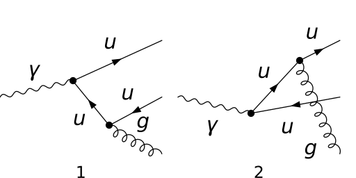

## Obtain the amplitude

```mathematica
amp[0] = FCFAConvert[CreateFeynAmp[diags], 
     IncomingMomenta -> {p}, OutgoingMomenta -> {k1, k2, k3}, 
     UndoChiralSplittings -> True, ChangeDimension -> 4, 
     List -> False, SMP -> True, Contract -> True, 
     DropSumOver -> True, Prefactor -> (3/2)*SMP["e_Q"], 
     FinalSubstitutions -> {SMP["m_u"] -> SMP["m_q"]}]
```

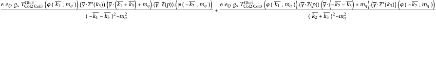

## Fix the kinematics

```mathematica
FCClearScalarProducts[]; 
SP[k1] = SMP["m_q"]^2; 
SP[k2] = SMP["m_q"]^2; 
SP[k3] = 0; 
SP[k1, k2] = (QQ/2)*(1 - x3); 
SP[k1, k3] = (QQ/2)*(1 - x2); 
SP[k2, k3] = (QQ/2)*(1 - x1); 
```

## Square the amplitude

```mathematica
ampSquared[0] = Simplify[FeynAmpDenominatorExplicit[
       DiracSimplify[FermionSpinSum[
           (DoPolarizationSums[#1, k3, 0, VirtualBoson -> True] & )[
             (DoPolarizationSums[#1, p, 0, VirtualBoson -> True] & )[
               SUNSimplify[amp[0]*ComplexConjugate[amp[0]]]]]]]]]
```

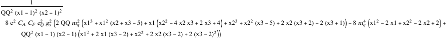

```mathematica
ampSquaredMassless[0] = 
   (SUNSimplify[#1, SUNNToCACF -> False] & )[
     Simplify[(#1 /. {SMP["m_q"] -> 0, x3 -> 2 - x1 - x2, 
                SMP["e"]^2 -> 4*Pi*SMP["alpha_fs"], SMP["g_s"]^2 -> 
                  4*Pi*SMP["alpha_s"]} & )[ampSquared[0]]]]
```

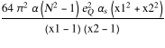

```mathematica
ampSquaredMasslessSUNN3[0] = ampSquaredMassless[0] /. SUNN -> 3
```


## Total decay rate

```mathematica
pref = (QQ/(128*Pi^3))*(1/(2*Sqrt[QQ]))
```


```mathematica
normBorn = 3*SMP["alpha_fs"]*SMP["e_Q"]^2*Sqrt[QQ]
```

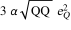

Differential cross-section normalized w.r.t to the Born cross-section 1/sigma_0 d sigma / (d x1 d x2)

```mathematica
normDiffCrossSection = ampSquaredMasslessSUNN3[0]*
     (pref/normBorn)
```

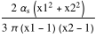

This integral is divergent for x1->1 and x2->1. The source of these divergences are infrared (when the gluon energy
approaches 0)  and collinear (when the gluon and quark become collinear) singularities.

```mathematica
If[$FrontEnd =!= Null, Plot3D[normDiffCrossSection /. 
       SMP["alpha_s"] -> 1, {x1, 0, 1}, {x2, 0, 1}]]
```

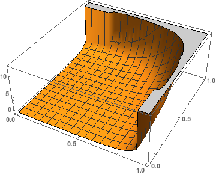

Introducing a regulator beta=m^2/Q^2 to enforce that the Mandelstam variables s and t are always larger than m^2 gives

```mathematica
normDiffCrossSection
```


```mathematica
tmpIntegral = Integrate[normDiffCrossSection, 
     {x2, 1 - x1, 1 - beta}, Assumptions -> 
       {beta < x1, beta > 0, x1 >= 0, x1 <= 1}]
```


```mathematica
integralReg = ConditionalExpression[
     ((5 - 10*beta - 4*(3 + (-4 + beta)*beta + (2*I)*Pi)*
               ArcTanh[1 - 2*beta] + 2*Log[1 - beta]*
               Log[(1 - beta)/beta^2] + 2*Log[beta]^2 + 
             4*PolyLog[2, (1 - beta)^(-1)] - 
       4*PolyLog[2, beta^(-1)])*
          SMP["alpha_s"])/(3*Pi), beta < 1/2]
```

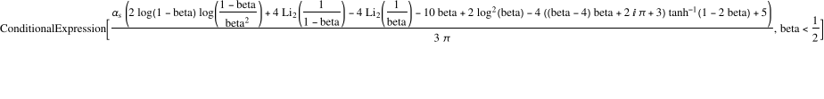

Expanding around beta=0 we obtain

```mathematica
integralRegExpanded = 
   Normal[Series[Simplify[Normal[integralReg]], {beta, 0, 0}, 
       Assumptions -> beta > 0]]
```

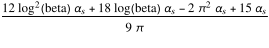

Factoring out the Born cross-section we arrive to

```mathematica
integralRegExpandedFinal = Collect2[integralRegExpanded, Log, 
     Pi, FCFactorOut -> (2/(3*Pi))*SMP["alpha_s"]]
```

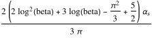

To get rid of the singularities we must also include the virtual contributions to the cross-section!

## Check the final results

```mathematica
knownResults = {(2*(x1^2 + x2^2)*SMP["alpha_s"])/
         (3*Pi*(-1 + x1)*(-1 + x2))}; 
FCCompareResults[{normDiffCrossSection}, knownResults, 
     Text -> {"\tCompare to Field, Applications of Perturbative \
    QCD, Eq. 2.3.32", "CORRECT.", "WRONG!"}, 
     Interrupt -> {Hold[Quit[1]], Automatic}]; 
Print["\tCPU Time used: ", Round[N[TimeUsed[], 4], 0.001], 
     " s."]; 
```

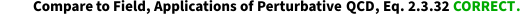

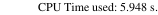