## Load FeynCalc and the necessary add-ons or other packages

```mathematica
description = 
     "Gl Gl -> Gl Gl, QCD, matrix element squared, tree"; 
If[$FrontEnd === Null, $FeynCalcStartupMessages = False; 
      Print[description]; ]; 
If[$Notebooks === False, $FeynCalcStartupMessages = False]; 
$LoadAddOns = {"FeynArts"}; 
Get["FeynCalc`"]
$FAVerbose = 0; 
FCCheckVersion[9, 3, 0]; 
```


## Generate Feynman diagrams

Nicer typesetting

```mathematica
MakeBoxes[k1, TraditionalForm] := 
     "\!\(\*SubscriptBox[\(k\), \(1\)]\)"; 
MakeBoxes[k2, TraditionalForm] := 
     "\!\(\*SubscriptBox[\(k\), \(2\)]\)"; 
MakeBoxes[k3, TraditionalForm] := 
     "\!\(\*SubscriptBox[\(k\), \(3\)]\)"; 
MakeBoxes[k4, TraditionalForm] := 
     "\!\(\*SubscriptBox[\(k\), \(4\)]\)"; 
```

```mathematica
diags = InsertFields[CreateTopologies[0, 2 -> 2], 
       {V[5], V[5]} -> {V[5], V[5]}, InsertionLevel -> {Classes}, 
       Model -> "SMQCD"]; 
Paint[diags, ColumnsXRows -> {2, 1}, Numbering -> Simple, 
     SheetHeader -> None, ImageSize -> {512, 256}]; 
```

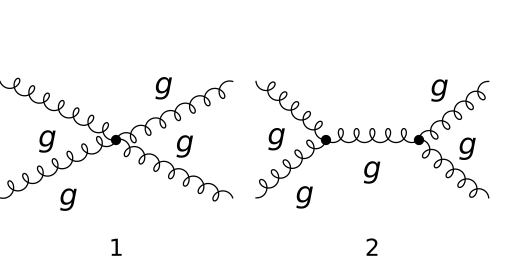

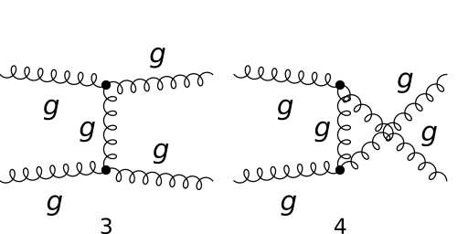

## Obtain the amplitude

```mathematica
amp[0] = FCFAConvert[CreateFeynAmp[diags], 
     IncomingMomenta -> {k1, k2}, OutgoingMomenta -> {k3, k4}, 
     UndoChiralSplittings -> True, ChangeDimension -> 4, 
     TransversePolarizationVectors -> {k1, k2, k3, k4}, 
     List -> True, SMP -> True, Contract -> True, 
     DropSumOver -> True]
```

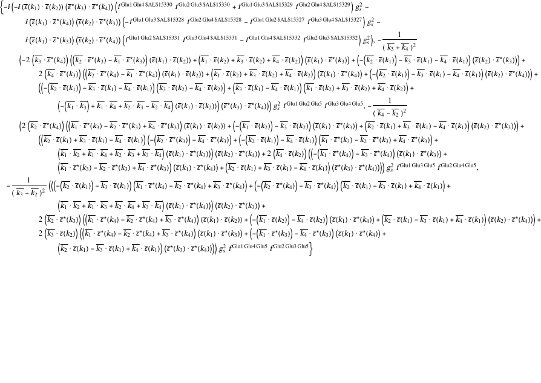

## Fix the kinematics

```mathematica
FCClearScalarProducts[]; 
SetMandelstam[s, t, u, k1, k2, -k3, -k4, 0, 0, 0, 0]; 
```

## Square the amplitude

```mathematica
ampSquared[0] = (SUNSimplify[#1, Explicit -> True, 
            SUNNToCACF -> False] & )[FeynAmpDenominatorExplicit[
         (1/(SUNN^2 - 1)^2)*(amp[1]*ComplexConjugate[amp[0]])]]; 
```

```mathematica
polsums[x_, vec_, aux_, spinfac_] := 
   (FixedPoint[ReleaseHold, #1] & )[
     (DoPolarizationSums[#1, vec, aux, ExtraFactor -> 
              spinfac] & )[(Isolate[#1, {Polarization[vec, __]}] & )[
         (Collect2[#1, Pair[_, Momentum[Polarization[vec, 
                      __]]]] & )[x]]]]
```

```mathematica
ClearAll[re]; 
Table[
     Print["    calculating color factors in products of the \
   amplitudes ", i, " and ", j, " (CC), time = ", 
        Timing[re[i, j] = (SUNSimplify[#1, Explicit -> True, 
                     SUNNToCACF -> False] & )[
       FeynAmpDenominatorExplicit[
                  
        amp[0][[i]]*ComplexConjugate[amp[0]][[j]]]]][[1]]]; 
      re[i, j], {i, 4}, {j, i}]; 
```


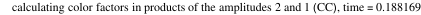


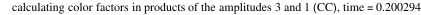

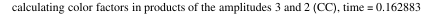


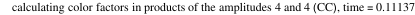

```mathematica
ClearAll[pre]; 
Table[Print["    calculating product of the amplitudes ", i, 
        " and ", j, " (CC), time = ", 
        Timing[pre[i, j] = Simplify[(polsums[#1, k4, k3, 1] & )[
                  (polsums[#1, k3, k4, 1] & )[
                    (polsums[#1, k2, k1, 1/2] & )[
                      (polsums[#1, k1, k2, 1/2] & )[
           re[i, j]]]]]]][[1]]]; 
      pre[i, j], {i, 4}, {j, i}]; 
```


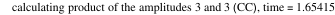


```mathematica
fpre[i_, j_] := pre[i, j] /; i >= j; 
fpre[i_, j_] := ComplexConjugate[pre[j, i]] /; i < j; 
ampSquared[0] = Simplify[(TrickMandelstam[#1, {s, t, u, 0}] & )[
       (1/(SUNN^2 - 1)^2)*Sum[fpre[i, j], {i, 1, 4}, {j, 1, 4}]]]
```

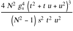

```mathematica
ampSquaredSUNN3[0] = ampSquared[0] /. SUNN -> 3
```

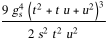

```mathematica
ampSquaredMassless[0] = (TrickMandelstam[#1, {s, t, u, 0}] & )[
     (#1 /. {SMP["m_u"] -> 0} & )[ampSquared[0]]]
```

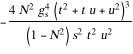

```mathematica
ampSquaredMasslessSUNN3[0] = ampSquaredMassless[0] /. SUNN -> 3
```


## Check the final results

```mathematica
knownResults = {(9/2)*SMP["g_s"]^4*(3 - t*(u/s^2) - s*(u/t^2) - 
            s*(t/u^2))}; 
FCCompareResults[{ampSquaredMasslessSUNN3[0]}, {knownResults}, 
   Text -> {"\tCompare to Ellis, Stirling and Weber, QCD and \
   Collider Physics, Table 7.1:", "CORRECT.", "WRONG!"}, 
   Interrupt -> {Hold[Quit[1]], Automatic}, 
   Factoring -> Function[x, Simplify[TrickMandelstam[x, 
           {s, t, u, 0}]]]]
Print["\tCPU Time used: ", Round[N[TimeUsed[], 3], 0.001], 
     " s."]; 
```


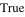

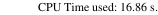