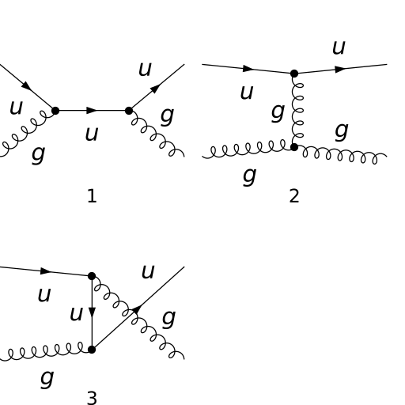
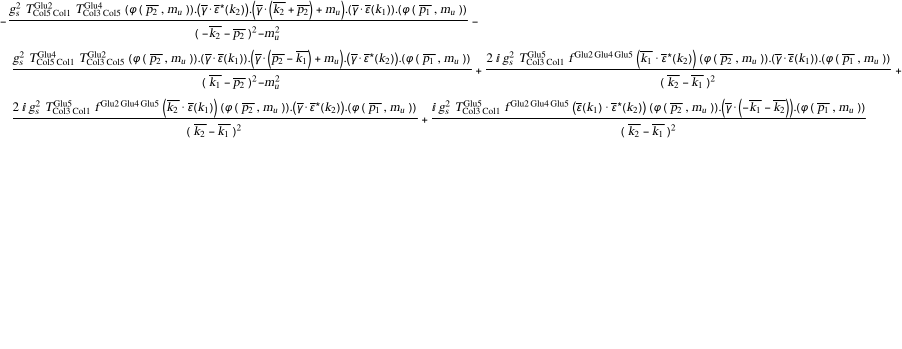
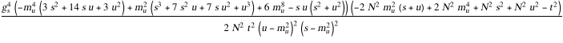
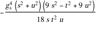
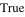
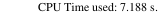

## Load FeynCalc and the necessary add-ons or other packages

```mathematica
description = 
     "Q Gl -> Q Gl, QCD, matrix element squared, tree"; 
If[$FrontEnd === Null, $FeynCalcStartupMessages = False; 
      Print[description]; ]; 
If[$Notebooks === False, $FeynCalcStartupMessages = False]; 
$LoadAddOns = {"FeynArts"}; 
Get["FeynCalc`"]
$FAVerbose = 0; 
FCCheckVersion[9, 3, 0]; 
```


## Generate Feynman diagrams

Nicer typesetting

```mathematica
MakeBoxes[p1, TraditionalForm] := 
     "\!\(\*SubscriptBox[\(p\), \(1\)]\)"; 
MakeBoxes[p2, TraditionalForm] := 
     "\!\(\*SubscriptBox[\(p\), \(2\)]\)"; 
MakeBoxes[k1, TraditionalForm] := 
     "\!\(\*SubscriptBox[\(k\), \(1\)]\)"; 
MakeBoxes[k2, TraditionalForm] := 
     "\!\(\*SubscriptBox[\(k\), \(2\)]\)"; 
```

```mathematica
diags = InsertFields[CreateTopologies[0, 2 -> 2], 
       {F[3, {1}], V[5]} -> {F[3, {1}], V[5]}, 
       InsertionLevel -> {Classes}, Model -> "SMQCD"]; 
Paint[diags, ColumnsXRows -> {2, 2}, Numbering -> Simple, 
     SheetHeader -> None, ImageSize -> {512, 512}]; 
```



## Obtain the amplitude

```mathematica
amp[0] = FCFAConvert[CreateFeynAmp[diags], 
     IncomingMomenta -> {p1, k1}, OutgoingMomenta -> {p2, k2}, 
     UndoChiralSplittings -> True, ChangeDimension -> 4, 
     TransversePolarizationVectors -> {k1, k2}, List -> False, 
     SMP -> True, Contract -> True, DropSumOver -> True]
```



## Fix the kinematics

```mathematica
FCClearScalarProducts[]; 
SetMandelstam[s, t, u, p1, k1, -p2, -k2, SMP["m_u"], 0, 
     SMP["m_u"], 0]; 
```

## Square the amplitude

```mathematica
ampSquared[0] = Simplify[
     (TrickMandelstam[#1, {s, t, u, 2*SMP["m_u"]^2}] & )[
       (DoPolarizationSums[#1, k2, k1] & )[
         (DoPolarizationSums[#1, k1, k2, ExtraFactor -> 1/2] & )[
           DiracSimplify[(FermionSpinSum[#1, ExtraFactor -> 1/2] & )[
               (SUNSimplify[#1, Explicit -> True, SUNNToCACF -> 
                        False] & )[FeynAmpDenominatorExplicit[
                   (1/(SUNN*(SUNN^2 - 1)))*(amp[0]*ComplexConjugate[
                          amp[0]])]]]]]]]]
```



```mathematica
ampSquaredMassless[0] = Simplify[(#1 /. {SMP["m_u"] -> 0} & )[
       ampSquared[0]]]
```


```mathematica
ampSquaredMasslessSUNN3[0] = ampSquaredMassless[0] /. SUNN -> 3
```



## Check the final results

```mathematica
knownResults = {(-(4/9))*SMP["g_s"]^4*((s^2 + u^2)/(s*u)) + 
         SMP["g_s"]^4*((u^2 + s^2)/t^2)}; 
FCCompareResults[{ampSquaredMasslessSUNN3[0]}, {knownResults}, 
   Text -> {"\tCompare to Ellis, Stirling and Weber, QCD and \
   Collider Physics, Table 7.1:", "CORRECT.", "WRONG!"}, 
   Interrupt -> {Hold[Quit[1]], Automatic}, 
   Factoring -> Function[x, Simplify[TrickMandelstam[x, 
           {s, t, u, 0}]]]]
Print["\tCPU Time used: ", Round[N[TimeUsed[], 3], 0.001], 
     " s."]; 
```




