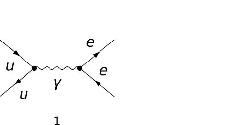
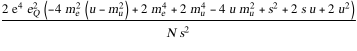
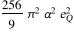
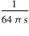
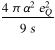
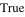

## Load FeynCalc and the necessary add-ons or other packages

```mathematica
description = 
     "Q Qbar -> El Ael, QCD, total cross section, tree"; 
If[$FrontEnd === Null, $FeynCalcStartupMessages = False; 
      Print[description]; ]; 
If[$Notebooks === False, $FeynCalcStartupMessages = False]; 
$LoadAddOns = {"FeynArts"}; 
Get["FeynCalc`"]
$FAVerbose = 0; 
FCCheckVersion[9, 3, 0]; 
```


## Generate Feynman diagrams

Nicer typesetting

```mathematica
MakeBoxes[p1, TraditionalForm] := 
     "\!\(\*SubscriptBox[\(p\), \(1\)]\)"; 
MakeBoxes[p2, TraditionalForm] := 
     "\!\(\*SubscriptBox[\(p\), \(2\)]\)"; 
MakeBoxes[k1, TraditionalForm] := 
     "\!\(\*SubscriptBox[\(k\), \(1\)]\)"; 
MakeBoxes[k2, TraditionalForm] := 
     "\!\(\*SubscriptBox[\(k\), \(2\)]\)"; 
```

```mathematica
diags = InsertFields[CreateTopologies[0, 2 -> 2], 
       {F[3, {1}], -F[3, {1}]} -> {F[2, {1}], -F[2, {1}]}, 
       InsertionLevel -> {Classes}, Model -> "SMQCD", 
       ExcludeParticles -> {S[_], V[2]}]; 
Paint[diags, ColumnsXRows -> {2, 1}, Numbering -> Simple, 
     SheetHeader -> None, ImageSize -> {512, 256}]; 
```



## Obtain the amplitude

```mathematica
amp[0] = FCFAConvert[CreateFeynAmp[diags], 
     IncomingMomenta -> {p1, p2}, OutgoingMomenta -> {k1, k2}, 
     UndoChiralSplittings -> True, ChangeDimension -> 4, 
     List -> False, SMP -> True, Contract -> True, 
     DropSumOver -> True, Prefactor -> (3/2)*SMP["e_Q"]]
```


## Fix the kinematics

```mathematica
FCClearScalarProducts[]; 
SetMandelstam[s, t, u, p1, p2, -k1, -k2, SMP["m_u"], 
     SMP["m_u"], SMP["m_e"], SMP["m_e"]]; 
```

## Square the amplitude

```mathematica
ampSquared[0] = Simplify[
     (TrickMandelstam[#1, {s, t, u, 2*SMP["m_u"]^2 + 
                2*SMP["m_e"]^2}] & )[DiracSimplify[
         (FermionSpinSum[#1, ExtraFactor -> 1/2^2] & )[
           (SUNSimplify[#1, Explicit -> True, SUNNToCACF -> 
                    False] & )[FeynAmpDenominatorExplicit[
               (1/SUNN^2)*(amp[0]*ComplexConjugate[amp[0]])]]]]]]
```



```mathematica
ampSquaredMassless[0] = (TrickMandelstam[#1, {s, t, u, 0}] & )[
     (#1 /. {SMP["m_u" | "m_e"] -> 0} & )[ampSquared[0]]]
```


```mathematica
ampSquaredMasslessSUNN3[0] = ampSquaredMassless[0] /. SUNN -> 3
```


## Total cross-section

```mathematica
integral = Integrate[Simplify[ampSquaredMasslessSUNN3[0]/
             (s/4) /. u -> -s - t], {t, -s, 0}] /. 
     SMP["e"]^4 -> (4*Pi*SMP["alpha_fs"])^2
```



```mathematica
prefac = 2*(Pi/(128*Pi^2*s))
```



The total cross-section 

```mathematica
crossSectionTotal = Factor2[PowerExpand[integral*prefac]]
```



## Check the final results

```mathematica
knownResults = {(2*(t^2 + u^2)*SMP["e"]^4*SMP["e_Q"]^2)/
         (3*s^2), (4*Pi*SMP["alpha_fs"]^2*SMP["e_Q"]^2)/(9*s)}; 
FCCompareResults[{ampSquaredMasslessSUNN3[0], 
     crossSectionTotal}, knownResults, 
   Text -> {"\tCompare to CalcHEP  and to Field, Applications of \
   Perturbative QCD, Eq. 5.1.17:", "CORRECT.", "WRONG!"}, 
   Interrupt -> {Hold[Quit[1]], Automatic}]
Print["\tCPU Time used: ", Round[N[TimeUsed[], 3], 0.001], 
     " s."]; 
```




