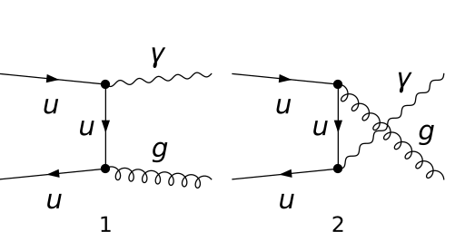
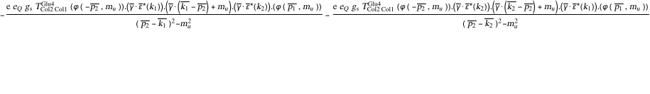
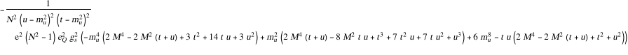
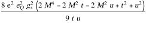
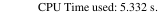

## Load FeynCalc and the necessary add-ons or other packages

```mathematica
description = 
     "Q Qbar -> Ga Gl, QCD, matrix element squared, tree"; 
If[$FrontEnd === Null, $FeynCalcStartupMessages = False; 
      Print[description]; ]; 
If[$Notebooks === False, $FeynCalcStartupMessages = False]; 
$LoadAddOns = {"FeynArts"}; 
Get["FeynCalc`"]
$FAVerbose = 0; 
FCCheckVersion[9, 3, 0]; 
```


## Generate Feynman diagrams

Nicer typesetting

```mathematica
MakeBoxes[p1, TraditionalForm] := 
     "\!\(\*SubscriptBox[\(p\), \(1\)]\)"; 
MakeBoxes[p2, TraditionalForm] := 
     "\!\(\*SubscriptBox[\(p\), \(2\)]\)"; 
MakeBoxes[k1, TraditionalForm] := 
     "\!\(\*SubscriptBox[\(k\), \(1\)]\)"; 
MakeBoxes[k2, TraditionalForm] := 
     "\!\(\*SubscriptBox[\(k\), \(2\)]\)"; 
```

```mathematica
diags = InsertFields[CreateTopologies[0, 2 -> 2], 
       {F[3, {1}], -F[3, {1}]} -> {V[1], V[5]}, 
       InsertionLevel -> {Classes}, Model -> "SMQCD"]; 
Paint[diags, ColumnsXRows -> {2, 1}, Numbering -> Simple, 
     SheetHeader -> None, ImageSize -> {512, 256}]; 
```



## Obtain the amplitude

```mathematica
amp[0] = FCFAConvert[CreateFeynAmp[diags], 
     IncomingMomenta -> {p1, p2}, OutgoingMomenta -> {k1, k2}, 
     UndoChiralSplittings -> True, ChangeDimension -> 4, 
     TransversePolarizationVectors -> {k2}, List -> False, 
     SMP -> True, Contract -> True, DropSumOver -> True, 
     Prefactor -> (3/2)*SMP["e_Q"]]
```



## Fix the kinematics

```mathematica
FCClearScalarProducts[]; 
SetMandelstam[s, t, u, p1, p2, -k1, -k2, SMP["m_u"], 
     SMP["m_u"], M, 0]; 
```

## Square the amplitude

Now come the usual steps, but with some special features. We do not average over the polarizations of the virtual photon but use the gauge trick for the sum over its polarizations. In this case the sum goes over all 4 unphysical polarizations,  not just 2.

```mathematica
ampSquared[0] = Simplify[
     (TrickMandelstam[#1, {s, t, u, 2*SMP["m_u"]^2 + M^2}] & )[
       (DoPolarizationSums[#1, k2, k1] & )[
         (DoPolarizationSums[#1, k1, 0, VirtualBoson -> True, 
                GaugeTrickN -> 4] & )[DiracSimplify[
             (FermionSpinSum[#1, ExtraFactor -> 1/2^2] & )[
               (SUNSimplify[#1, Explicit -> True, SUNNToCACF -> 
                        False] & )[FeynAmpDenominatorExplicit[
                   (1/SUNN^2)*(amp[0]*
            ComplexConjugate[amp[0]])]]]]]]]]
```



```mathematica
ampSquaredMassless[0] = 
   (TrickMandelstam[#1, {s, t, u, M^2}] & )[
     (#1 /. {SMP["m_u"] -> 0} & )[ampSquared[0]]]
```


```mathematica
ampSquaredMasslessSUNN3[0] = ampSquaredMassless[0] /. SUNN -> 3
```



## Check the final results

```mathematica
knownResults = {(8/9)*SMP["e"]^2*SMP["e_Q"]^2*SMP["g_s"]^2*
         (u/t + t/u + 2*M^2*((-t - u + M^2)/(t*u)))}; 
FCCompareResults[{ampSquaredMasslessSUNN3[0]}, {knownResults}, 
     Text -> {"\tCheck with R. Field, Applications of \
    Perturbative QCD, Eq 5.2.3:", "CORRECT.", "WRONG!"}, 
     Interrupt -> {Hold[Quit[1]], Automatic}]; 
Print["\tCPU Time used: ", Round[N[TimeUsed[], 3], 0.001], 
     " s."]; 
```


