## Load FeynCalc and the necessary add-ons or other packages

```mathematica
description = "Gh -> Gh, massless QCD, 2-loops"; 
If[$FrontEnd === Null, $FeynCalcStartupMessages = False; 
      Print[description]; ]; 
If[$Notebooks === False, $FeynCalcStartupMessages = False]; 
$LoadAddOns = {"TARCER", "FeynArts"}; 
Get["FeynCalc`"]
$FAVerbose = 0; 
FCCheckVersion[9, 3, 0]; 
```


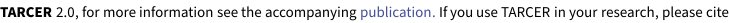

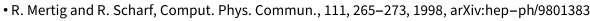


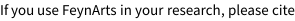

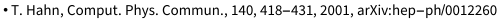

## Generate Feynman diagrams

Nicer typesetting

```mathematica
diags = InsertFields[CreateTopologies[2, 1 -> 1, 
         ExcludeTopologies -> {Tadpoles}], {U[5]} -> {U[5]}, 
       InsertionLevel -> {Classes}, Model -> "SMQCD"]; 
Paint[diags, ColumnsXRows -> {4, 1}, Numbering -> Simple, 
     SheetHeader -> None, ImageSize -> {768, 256}]; 
```

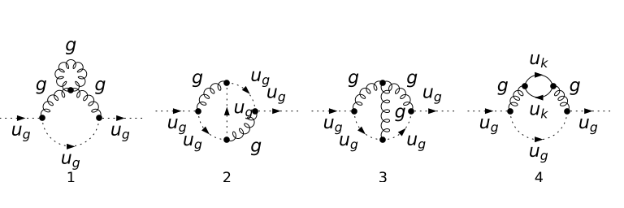

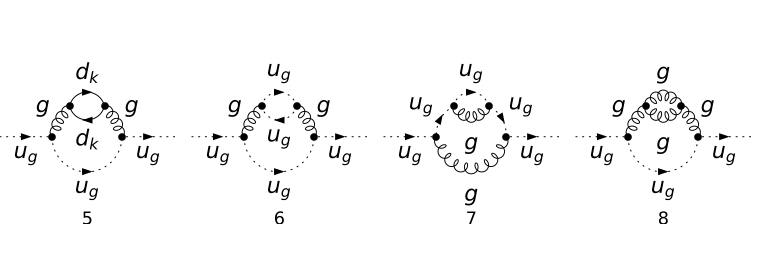

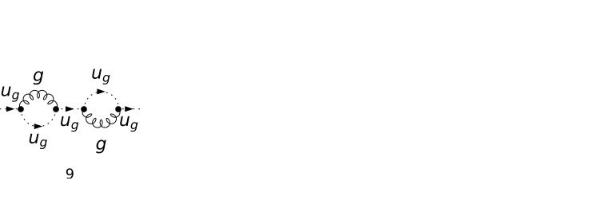

## Obtain the amplitude

The prefactor 1/(2Pi)^(2D) for the loop integrals is understood. Notice that we ignore the first diagram (zero in DR) and the fifth diagram, since its contribution is identical to that of the fourth diagram.

```mathematica
amp[0] = FCFAConvert[CreateFeynAmp[DiagramExtract[diags, 
           {2, 3, 4, 6, 7, 8, 9}], Truncated -> True, 
         GaugeRules -> {}, PreFactor -> -I], IncomingMomenta -> 
         {p}, OutgoingMomenta -> {p}, LoopMomenta -> {q1, q2}, 
       UndoChiralSplittings -> True, ChangeDimension -> D, 
       List -> True, SMP -> True, DropSumOver -> True, 
       FinalSubstitutions -> {MQU[Index[Generation, 3]] -> 0, 
           GaugeXi[_] -> 1 - GaugeXi}]; 
```

## Fix the kinematics

```mathematica
FCClearScalarProducts[]; 
ScalarProduct[p, p] = pp; 
```

## Calculate the amplitude

```mathematica
amp[1] = FCTraceFactor /@ amp[0]; 
```

We simplify the color and Dirac algebra, do some partial fractioning and convert the integrals to the TRACER notation. To do  this we define the following helper function

```mathematica
RepRuleCancelQP = 
     {(x_.)*Pair[Momentum[q_, dim_: 4], Momentum[q_, dim_: 4]]^(n_)*
           FeynAmpDenominator[a___, PD[Momentum[q_, dim_: 4], 0], 
             b___] :> x*Pair[Momentum[q, dim], Momentum[q, dim]]^
             (n - 1)*FeynAmpDenominator[a, b], 
       (x_.)*Pair[Momentum[q_, dim_: 4], Momentum[q_, dim_: 4]]*
           FeynAmpDenominator[a___, PD[Momentum[q_, dim_: 4], 0], 
             b___] :> x*FeynAmpDenominator[a, b], 
       (x_.)*Pair[Momentum[p_, dim_: 4], Momentum[q_, dim_: 4]]*
           FeynAmpDenominator[a___, PD[Momentum[q_, dim_: 4] - 
                 Momentum[p_, dim_: 4], 0], b___] :> 
         (-(1/2))*x*FeynAmpDenominator[a, b] + 
           (1/2)*x*Pair[Momentum[p, dim], Momentum[p, dim]]*
             FeynAmpDenominator[a, PD[Momentum[q, dim] - 
                   Momentum[p, dim], 0], b] + 
           (1/2)*x*Pair[Momentum[q, dim], Momentum[q, dim]]*
             FeynAmpDenominator[a, PD[Momentum[q, dim] - 
                   Momentum[p, dim], 0], b], 
       (x_.)*Pair[Momentum[p_, dim_: 4], Momentum[q_, dim_: 4]]^(n_)*
           FeynAmpDenominator[a___, PD[Momentum[q_, dim_: 4] - 
                 Momentum[p_, dim_: 4], 0], b___] :> 
         (-(1/2))*x*Pair[Momentum[p, dim], Momentum[q, dim]]^
               (n - 1)*FeynAmpDenominator[a, b] + 
           (1/2)*x*Pair[Momentum[p, dim], Momentum[q, dim]]^(n - 1)*
             Pair[Momentum[p, dim], Momentum[p, dim]]*
             FeynAmpDenominator[a, PD[Momentum[q, dim] - 
                   Momentum[p, dim], 0], b] + 
           (1/2)*x*Pair[Momentum[p, dim], Momentum[q, dim]]^(n - 1)*
             Pair[Momentum[q, dim], Momentum[q, dim]]*
             FeynAmpDenominator[a, PD[Momentum[q, dim] - 
                   Momentum[p, dim], 0], b]}; 
ClearAll[diagCompute]; 
diagCompute[ex_] := (ToTFI[#1, q1, q2, p] & )[
       (#1 /. loopHead -> Identity & )[(#1 //. RepRuleCancelQP & )[
           (FCLoopIsolate[#1, {q1, q2}, Head -> loopHead] & )[
             Contract[(#1 /. DiracTrace[x__] :> DiracTrace[x, 
                          DiracTraceEvaluate -> True] & )[
                 (SUNSimplify[#1, Explicit -> True, SUNTrace -> 
                          True] & )[ex]]]]]]]; 
```

and apply it to every single amplitude.

```mathematica
AbsoluteTiming[amp[2] = diagCompute /@ amp[1]; ]
```

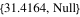

```mathematica
allints = Cases2[amp[2], TFI]; 
Length[allints]
```

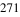

There are 271 integrals to be done for the ghost self energy. There are several possibilities how to proceed. One possibility is to calculate the integrals one by one and save them to a file in the Database directory. This can be conveniently done using the CheckDB function. If the file "IntegralsQCDTwoLoopGhostSelfEnergy.db" does not exist the first argument of CheckDB is evaluated, otherwise the list is loaded and assigned to inttable.

```mathematica
Timing[inttable = CheckDB[Dispatch[
           Thread[allints -> Table[WriteString["stdout", "."]; 
                  
        TarcerRecurse[allints[[i]]], {i, Length[allints]}]]], 
         "IntegralsQCDTwoLoopGhostSelfEnergy.db"]; ]
```

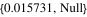

Now we need to insert the calculated integrals and rewrite the whole expression into a nicer form. Note that the Tarcer two loop integrals are defined to have only 1/(Pi)^D in the measure. Therefore, we will need to multiply the full result by 1/(4Pi)^D, since we did not include the prefactor (1/(2Pi)^D)^2 in the very beginning.

```mathematica
Timing[amp[3] = FeynAmpDenominatorExplicit[
         FCI[(Collect2[#1, {TAI, TBI, TJI}, Factoring -> 
                    Factor2] & ) /@ (amp[2] /. inttable)]]; ]
```


The final result

```mathematica
resFinal = amp[3] //. SMP["g_s"] :> gs
```

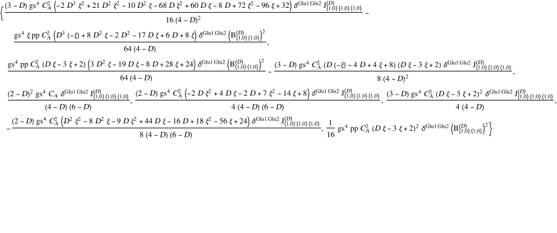

## Check the final results

Now let us compare our result with the literature. This computation can be found in A.I. Davydychev, P .Osland, O.V. Tarasov, Phys. Rev. D 58, 036007 (1998). The preprint is available at arXiv:hep-ph/9801380.

The general expression for the ghost self-energy (two-point function) is given by Eq. 2.15. What we computed is  -delta^{a1 a2} p^2 G^{(2)}(p^2) (c.f. Eq. 6.5).  The authors write G^{(2)}(p^2) as G^{(2,q)}(p^2) + G^{(2,ξ)(red)}(p^2) + G^{(2,ξ)(irred)}(p^2) (c.f. Eq 2.6), where  G^{(2,q)}(p^2) is the contribution of the quark loops (both one-particle irreducible and one-particle reducible), G^{(2,ξ)(irred)}(p^2) is the one particle irreducible contribution of the gluon and ghost loops and G^{(2,ξ)(red)}(p^2) is the one particle reducible one.

The quark loop contribution is given by the third diagram

```mathematica
G2q = resFinal[[3]]
```

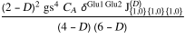

This should give us the same as Eq 6.13, with T = Nf Tf (c.f. Eq. 4.6) and eta  = ( Gamma[D/2-1]^2 Gamma[3-D/2] ) / Gamma[D-3]. Remember that we must remove - delta^{ab} p^2 from our G2q and multiply it by (1/(4Pi)^D).

```mathematica
G2qEval = (-((4*Pi)^D)^(-1))*TarcerExpand[G2q, 
           D -> 4 - 2*Epsilon, 0] /. pp*SUNDelta[a_, b_] -> 1 /. 
     CA -> 2*T*CA
```


Our result contains SEpsilon[4 - 2*Epsilon] which is an abbreviation for Exp[-Epsilon*EulerGamma]. Since eta is given by Exp[- Epsilon*EulerGamma] (1- 1/12 Pi^2 Epsilon^2 + ...) (c.f. Eq 4.7), it is clear that SEpsilon[4 - 2*Epsilon]^2 comes from there. To bring our result into the suitable form, we therefore must divide the term in the brackets by (1- 1/12 Pi^2 Epsilon^2)^2 or (1- Zeta2/2 Epsilon^2)^2  and again expand it in Epsilon. After that we can replace  SEpsilon[4 - 2*Epsilon]^2 by eta^2.

```mathematica
G2qFinal = (#1 /. {SEpsilon[4 - 2*Epsilon]^2 -> eta^2, 
            gs -> SMP["g_s"]} & )[
     (#1 /. (a_) . (b_) :> a . Normal[Series[
                    
          b/(1 - (Zeta2/2)*Epsilon^2)^2, {Epsilon, 0, 0}]] & )[
       G2qEval]]
```

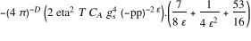

```mathematica
G2qFinalPaper = ((CA*eta^2*SMP["g_s"]^4*T)/(-pp)^(2*Epsilon))*
       ((-53/8 - 1/(2*Epsilon^2) - 7/(4*Epsilon))/(4*Pi)^D); 
```

Repeat the same for G^{(2,ξ)(red)}(p^2) which is given by Eq. 6.14. The reducible part comes from the diagram 7, hence

```mathematica
G2xiRed = resFinal[[7]]; 
G2xiRedEval = (#1 //. {pp*SUNDelta[a_, b_] -> 1} & )[
       (-((4*Pi)^D)^(-1))*TarcerExpand[G2xiRed, 
           D -> 4 - 2*Epsilon, 0]]; 
G2xiRedFinal = (#1 /. {SEpsilon[4 - 2*Epsilon]^2 -> eta^2, 
            gs -> SMP["g_s"]} & )[
     (#1 /. (a_) . (b_) :> a . Normal[Series[
                    
          b/(1 - (Zeta2/2)*Epsilon^2)^2, {Epsilon, 0, 0}]] & )[
       G2xiRedEval]]
```

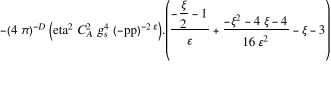

```mathematica
G2xiRedPaper = ((CA^2*eta^2*SMP["g_s"]^4)/(-pp)^(2*Epsilon))*
       ((3 + (1 + GaugeXi/2)/Epsilon + GaugeXi + 
             (4 + 4*GaugeXi + GaugeXi^2)/(16*Epsilon^2))/(4*Pi)^D); 
```

Finally, we still need to verify G^{(2,ξ)(irred)}(p^2), the irreducible contribution of the gluon and ghost loops given by the remaining diagrams and shown in Eq 6.12

```mathematica
G2xiIrred = Collect2[Plus @@ Join[resFinal[[1 ;; 2]], 
           resFinal[[4 ;; 6]]], {TBI, TJI}]; 
G2xiIrredEval = (#1 //. {pp*SUNDelta[a_, b_] -> 1, 
              Nf*Tf -> T} & )[(-((4*Pi)^D)^(-1))*
         TarcerExpand[G2xiIrred, D -> 4 - 2*Epsilon, 0]]; 
G2xiIrredFinal = (#1 /. {SEpsilon[4 - 2*Epsilon]^2 -> eta^2, 
            gs -> SMP["g_s"]} & )[
     (#1 /. (a_) . (b_) :> a . Normal[Series[
                    
          b/(1 - (Zeta2/2)*Epsilon^2)^2, {Epsilon, 0, 0}]] & )[
       (#1 /. (a_) . ((SEpsilon[x_]^2*(b_))/(-pp)^(2*Epsilon)) :> 
                ((SEpsilon[x]^2*a)/(-pp)^(2*Epsilon)) . b & )[
         (#1 /. (a_) . (b_) :> a . Collect[b, {SEpsilon[_], 
                        (-pp)^(-2*Epsilon)}] & )[G2xiIrredEval]]]]
```


```mathematica
G2xiIrredPaper = ((CA^2*eta^2*SMP["g_s"]^4)/(-pp)^(2*Epsilon))*
       (((1/Epsilon)*(67/16 - (9*GaugeXi)/32) + 
             (1 + (3*GaugeXi)/16 - (3*GaugeXi^2)/32)/Epsilon^2 + 
             503/32 + (-73*GaugeXi)/64 + (3*GaugeXi^2)/8 - 
             (3*Zeta[3])/4 - (3*GaugeXi^2*Zeta[3])/16)/(4*Pi)^D); 
```

Last but not least, let us verify the full contribution of the gluon and ghost loops which is given by Eq. 6.15

```mathematica
G2xFinal = (#1 /. (f_)*(a_) . (b_) + (f_)*(a_) . (c_) :> 
            f*a . Collect[Simplify[b + c], {1/Epsilon}] & )[
     G2xiIrredFinal + G2xiRedFinal]
```

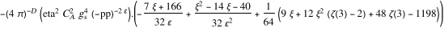

```mathematica
G2xPaper = ((CA^2*eta^2*SMP["g_s"]^4)/(-pp)^(2*Epsilon))*
       (((83/16 + (7/32)*GaugeXi)/Epsilon + 
             (5/4 + (7/16)*GaugeXi - (1/32)*GaugeXi^2)/Epsilon^2 + 
             599/32 - (3/4)*Zeta[3] - (9/64)*GaugeXi + 
             (3/8)*GaugeXi^2 - (3/16)*GaugeXi^2*Zeta[3])/(4*Pi)^D); 
```

```mathematica
knownResult = {G2qFinalPaper, G2xiRedPaper, G2xiIrredPaper, 
       G2xPaper}; 
FCCompareResults[{G2qFinal, G2xiRedFinal, G2xiIrredFinal, 
         G2xFinal} /. {Dot -> Times}, knownResult, 
     Text -> {"\tCompare to Davydychev, Osland and Tarasov, \
    hep-ph/9801380, Eqs. 6.12-6.15:", "CORRECT.", "WRONG!"}, 
     Interrupt -> {Hold[Quit[1]], Automatic}, 
     Factoring -> Simplify]; 
Print["\tCPU Time used: ", Round[N[TimeUsed[], 4], 0.001], 
     " s."]; 
```


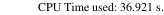