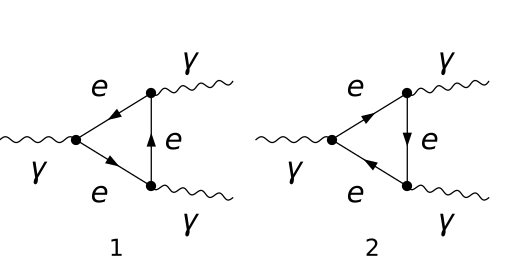
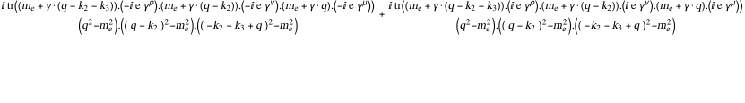
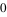
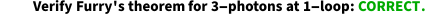
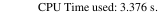

## Load FeynCalc and the necessary add-ons or other packages

```mathematica
description = "Ga -> Ga Ga, QED, amplitude, 1-loop"; 
If[$FrontEnd === Null, $FeynCalcStartupMessages = False; 
      Print[description]; ]; 
If[$Notebooks === False, $FeynCalcStartupMessages = False]; 
$LoadAddOns = {"FeynArts"}; 
Get["FeynCalc`"]
$FAVerbose = 0; 
FCCheckVersion[9, 3, 0]; 
```


## Generate Feynman diagrams

Nicer typesetting

```mathematica
MakeBoxes[mu, TraditionalForm] := "\[Mu]"; 
MakeBoxes[nu, TraditionalForm] := "\[Nu]"; 
MakeBoxes[rho, TraditionalForm] := "\[Rho]"; 
MakeBoxes[k1, TraditionalForm] := 
     "\!\(\*SubscriptBox[\(k\), \(1\)]\)"; 
MakeBoxes[k2, TraditionalForm] := 
     "\!\(\*SubscriptBox[\(k\), \(2\)]\)"; 
MakeBoxes[k3, TraditionalForm] := 
     "\!\(\*SubscriptBox[\(k\), \(3\)]\)"; 
```

```mathematica
diags = InsertFields[CreateTopologies[1, 1 -> 2], 
       {V[1]} -> {V[1], V[1]}, InsertionLevel -> {Particles}, 
       ExcludeParticles -> {S[_], V[_], U[_], F[3 | 4], 
           F[2, {2 | 3}]}]; 
Paint[diags, ColumnsXRows -> {2, 1}, Numbering -> Simple, 
     SheetHeader -> None, ImageSize -> {512, 256}]; 
```



## Obtain the amplitude

The 1/(2Pi)^D prefactor is implicit.

```mathematica
amp[0] = FCFAConvert[CreateFeynAmp[diags, PreFactor -> 1, 
       Truncated -> True], IncomingMomenta -> {k1}, 
     OutgoingMomenta -> {k2, k3}, LoopMomenta -> {q}, 
     LorentzIndexNames -> {mu, nu, rho}, UndoChiralSplittings -> 
       True, ChangeDimension -> D, List -> False, SMP -> True]
```



## Calculate the amplitude

We obtain two triangle diagrams. The sum vanishes because the contribution of the first diagram cancels the contribution of the second diagram.

```mathematica
amp[1] = FCTraceFactor[amp[0]]
```



## Check the final results

```mathematica
FCCompareResults[amp[1], 0, 
     Text -> 
       {"\tVerify Furry's theorem for 3-photons at 1-loop:", 
         "CORRECT.", "WRONG!"}, Interrupt -> 
       {Hold[Quit[1]], Automatic}]; 
Print["\tCPU Time used: ", Round[N[TimeUsed[], 4], 0.001], 
     " s."]; 
```



