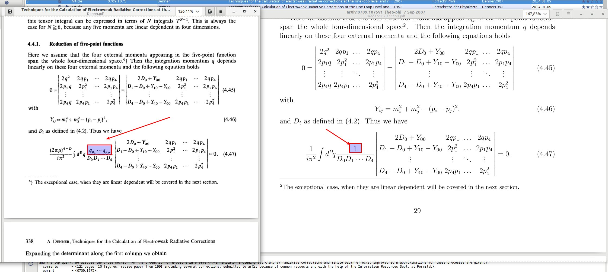

**Name:** Vladyslav Shtabovenko
**Date:** 01/30/17-09:17:23 PM Z

  - **Next message:** [Pablo Sanchez Puertas: "Re: E0 scalar
    function"](1204.html)
  - **Previous message:** [Vladyslav Shtabovenko: "Re: Possible bug with
    PaVeReduce in FeynCalc 9.2"](1202.html)
  - **In reply to:** [Pablo Sanchez Puertas: "Re: E0 scalar
    function"](1200.html)
  - **Next in thread:** [Pablo Sanchez Puertas: "Re: E0 scalar
    function"](1204.html)

-----

Hi,  

sorry for the late reply. I'm actually aware of this issue,  
and if you download the development version of FeynCalc, you  
can see that  

NPointTo4Point[  
  FCI[FVD[q,  
     mu] FAD[{q, m0}, {q + p1, m1}, {q + p2, m2}, {q + p3,  
      m3}, {q + p4, m4}]], q]  

and alike remain unevaluated. The same holds also for higher  
point functions.  

Historically, Eq. 4.47 given in Denner's original  
publication (the one that was published in Fortschritte der Physik,
i.e.  
\<<http://dx.doi.org/10.1002/prop.2190410402>\>, not the arXiv version)
was  
claimed to be also valid for tensor functions. This is how it got into  
FeynCalc. Later on it was noticed that additional terms corresponding
to  
possible UV divergences are missing (c.f. introduction to  
arXiv:hep-ph/0212259) and when an arXiv version of  
\<<http://dx.doi.org/10.1002/prop.2190410402>\> became available, the
old  
formula was corrected accordingly. C.f. also the attached screenshot.  

Personally, I'm not very happy even with the current scalar 5-point  
reduction, as it assumes mass regularization of IR divergences, which,  
in my view, something that inexperienced users may mess up. The most  
general way would be to have the formula where both UV and IR  
divergences are assumed to be regularized dimensionally. Such a
formula  
for sure exists (probably in one of Denner's papers), but currently
for  
me it would a lot of work with very little gain (you are the first to  
ask about E0 since years :) ) to find, implement and test it.  

Apart from that, the reduction of tensor N-point functions (with  
non-zero Gram determinant) can be done with TID, e.g.  

TID[FCI[FVD[q,  
     mu] FAD[{q, m0}, {q + p1, m1}, {q + p2, m2}, {q + p3,  
      m3}, {q + p4, m4}]], q]  

In this case you get the fully general (and huge) D-dimensional result  
without any further assumptions.  

If there are zero gram determinants, then the decomposition would be  
given in terms of PaVe functions like in  

TID[FCI[FVD[q, mu] FVD[q,  
     nu] FAD[{q, m0}, {q + p1, m1}, {q + p2, m2}, {q + p3,  
      m3}, {q + p4, m4}]], q, UsePaVeBasis -\> True]  

You will not be able to reduce them further with PaVeReduce, but given  
the size of such symbolic reduction, you would probably not want to do  
that anyhow and rather use LoopTools or Collier right away.  

So the important missing thing is really only the 5-point (and
possibly  
also n-point) scalar reduction for IR-divergences handled in DR. I
think  
that Collier can actually do that, so the formula is 100% available  
somewhere.  

If you are interested in contributing and verifying the corresponding  
code, I would be happy to add that to NPointTo4Point.m  

Cheers,  
Vladyslav  

Am 26.01.2017 um 14:32 schrieb Pablo Sanchez Puertas:  
*\> Hello again.*  
*\>*  
*\> I just reinstalled FeynCalc and is working fine\! :D*  
*\> Thanks for the continuous support with the program\!*  
*\>*  
*\> Besides, but that would probably be a new thread, I*  
*\> would like to comment on the tensor 5-point function.*  
*\> (I don't really need it at the moment as I have*  
*\> alternative ways to deal with it, but could be of interest)*  
*\> I could notice that your implmentation relying in*  
*\> Eq. (4.54) from*  
*\>*  
*\> https://arxiv.org/pdf/0709.1075.pdf*  
*\>*  
*\> holds (quoting from the article above)*  
*\>*  
*\> " [...] if the Lorentz decomposition of the appearing*  
*\> tensor integrals contains only momenta and no metric*  
*\> tensors, which is the case for N geq. 6 or P = 0."*  
*\>*  
*\> Particularly, for the 5-point function (N=4), that implies*  
*\> that such is not generally the case whenever one deals*  
*\> with a tensor instead of a scalar function.*  
*\> If such is the case, there are additional terms which are*  
*\> documented (also from Denner and Dittmaier) in*  
*\>*  
*\> <http://inspirehep.net/record/605032>*  
*\>*  
*\> see the "V(and U) terms" there or Eq.(2.21). The terms*  
*\> implemented in "NPointto4Point.m" are only those in the*  
*\> first summation. I could check that, though the notebook I*  
*\> have is a bit messy. Let me know uf you are interested and*  
*\> I could try to provide you with a minimal working example*  
*\> of the isse.*  
*\>*  
*\>*  
*\> Pablo*  
*\>*  
*\>*  

-----

-----

  - **Next message:** [Pablo Sanchez Puertas: "Re: E0 scalar
    function"](1204.html)
  - **Previous message:** [Vladyslav Shtabovenko: "Re: Possible bug with
    PaVeReduce in FeynCalc 9.2"](1202.html)
  - **In reply to:** [Pablo Sanchez Puertas: "Re: E0 scalar
    function"](1200.html)
  - **Next in thread:** [Pablo Sanchez Puertas: "Re: E0 scalar
    function"](1204.html)

-----

